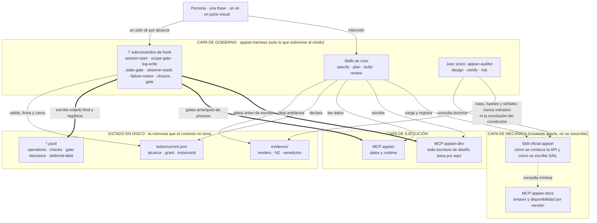

# appian-harness 0.7 → 1.0

> ## Única fuente normativa
>
> **Este es el único documento de diseño de la 0.7.** Si cualquier otro documento, nota o recuerdo
> contradice a este, **el otro está mal**. No hay una versión anterior con la que contrastar: los
> documentos que lo precedieron se retiraron a propósito, porque tener dos fuentes fue el defecto que
> más caro salió.
>
> Dos vecinos, y **ninguno de los dos es norma**: `decision-log.md`, que guarda *por qué* algunas
> reglas son como son —se consulta, no se cita como autoridad—, y `docs/archive/`, que conserva la
> trazabilidad de las revisiones que produjeron este diseño. Nada de lo que vive en `docs/archive/`
> decide nada.

**Fecha:** 1-sep-2026 · **Estado:** **DESIGN FREEZE — listo para implementar** (§ 21) · **Alcance:**
dos releases con contenido (0.7.0, 0.8.0) y una de cierre documental (1.0.0)

**Qué es.** La especificación completa de la 0.7: lo que el harness hace, lo que impone, con qué
evidencia cierra y qué tiene que cumplir para publicarse. Incorpora las dos pasadas de revisión a las
que se sometió el diseño —63 hallazgos en total— y la auditoría de consolidación del 1-sep-2026, todas
resueltas en el cuerpo. La trazabilidad hallazgo → sección vive **fuera**, en
`docs/archive/trazabilidad-hallazgos-0.7.md`: es histórico, y el histórico no decide.

**Cómo está escrito.** El cuerpo **afirma el diseño** en vez de narrar cómo se llegó a él. Cuando una
sección explica por qué se retiró una regla, es porque el motivo evita que se reintroduzca — no por
histórico.

**Qué desbloquea.** La tabla de transiciones legales, el escritor y la firma de los siete estados,
dónde vive `suspended`, la regla única del instrumento, dónde se mide la expresión y en qué evento, y
las filas de las puertas de salida están escritas aquí. Lo que queda antes de tocar código son las
cinco sondas de la Fase 0 y la comprobación de esquemas que las acompaña, que exigen entorno vivo.

---

## § 0 · Mapa del documento

Este documento se lee por capas, y esa es también la regla que impone al harness (§ 12). **Quien
implementa** necesita §§ 4-11. **Quien instala y usa** necesita §§ 1, 13, 14 y 20 — y nada más.
**Quien decide si esto merece existir** necesita §§ 1-3 y 17.

| § | Contenido | Para quién |
|---|---|---|
| 1 | Propósito, criterio de éxito y principio rector | todos |
| 2 | Las ocho garantías, con su clase de exigibilidad | decisor |
| 3 | Arquitectura: cuatro capas, y el reparto con la capa oficial | decisor · implementador |
| 4 | La unidad de alcance: esquema, estados y transiciones | implementador |
| 5 | Proporcionalidad: dos tamaños, dos carriles, una clase de daño | implementador · usuario avanzado |
| 6 | El permiso: un prompt por alcance | implementador |
| 7 | Los hooks y el perímetro | implementador |
| 8 | El suelo determinista por tipo de objeto | implementador |
| 9 | El juez único, la matriz y las clases de puerta | implementador |
| 10 | Cierre, deuda y memoria | implementador |
| 11 | Evidencia y artefactos | implementador |
| 12 | Contexto, tokens y progressive disclosure | implementador |
| 13 | Skills, agente y comando: la superficie que se toca | usuario |
| 14 | Onboarding: `/appian-init` y glosario | usuario |
| 15 | Migración desde 0.6 | implementador |
| 16 | Fases de implementación de 0.7 | implementador |
| 17 | Puertas de salida de 0.7 | decisor |
| 18 | Qué queda **fuera** de 0.7 | todos |
| 19 | Riesgos | decisor |
| 20 | Glosario | usuario |
| 21 | DESIGN FREEZE | todos |

---

## § 1 · Propósito, criterio de éxito y principio rector

### 1.1 Propósito

Este plugin gobierna a agentes que escriben en un entorno Appian compartido. Su propósito es
**facilitar el desarrollo Appian a un equipo**: que trabajar con IA sobre Appian sea mejor que
trabajar sin ella, con las garantías de impacto y de calidad intactas.

> **Una tarea que a mano cuesta muy poco no puede costar minutos ni horas con el harness. Si hacer
> una interfaz cuesta cuatro horas, no hay ganancia y nadie va a usar esto.**

### 1.2 El principio rector

> **Appian oficial para construir; el harness para gobernar lo que Appian no gobierna.**

De ahí sale la **regla de asignación**, que decide qué entra en este plugin y qué no:

> **El harness solo hace lo que sobrevive a que el modelo se olvide.**

Y tres consecuencias operativas, las tres comprobables:

| # | Regla | Consecuencia |
|---|---|---|
| **R1** | **Fuente única de mecánica.** Si la skill oficial especifica *cómo* se hace algo, el harness no lo reescribe: lo cita y exige su **rastro** | Un `references/` del harness que explique null-safety es deuda, no doctrina |
| **R2** | **Un solo prompt humano por decisión.** Cada decisión de una persona se pide **una vez**, y quien la pide es el grant | Los pasos previos de los workflows oficiales de confirmación son **insumo** del grant; el paso final **es** el grant (§ 6.2) |
| **R3** | **No se re-mide sin escritura conductual entre medias.** Una comprobación cuyo resultado no pudo cambiar no se vuelve a ejecutar | `checks.jsonl` es la memoria que hace esa regla verificable, no una promesa |

### 1.3 El criterio de éxito: ausencia de desperdicio

**No hay límites de tiempo, y es una decisión.** Cada trabajo debe tardar lo que corresponda: poner
un cronómetro a la construcción presiona hacia recortar por donde no se debe. Lo que se contrata es
la **ausencia de desperdicio**. La ceremonia es legítima; repetirla no.

| Clase de desperdicio | Qué es |
|---|---|
| **Trabajo repetido** | Volver a ejecutar una comprobación cuyo resultado no podía haber cambiado |
| **Trabajo innecesario** | Comprobar algo que la escritura no pudo alterar, o comprobar de una forma que nunca puede fallar |
| **Trabajo sin agrupar** | Hacer en N pasos, cada uno con su ceremonia completa, lo que era un solo paso |
| **Tiempo parado** | El agente bloqueado esperando en vez de trabajando |

El reloj se mide y se reporta porque es el síntoma visible, pero **el umbral está en el desperdicio,
no en la duración**.

### 1.4 La excepción declarada

Los cambios de **seguridad, datos y borrados** nunca van por el carril rápido, aunque a mano cuesten
segundos. En un entorno compartido de 459 aplicaciones esa franja paga ceremonia *a sabiendas*: es la
única clase donde la fiabilidad gana a la eficiencia, y se dice aquí para que nadie lo descubra como
sorpresa.

### 1.5 Dos reglas de diseño que este documento se aplica a sí mismo

- **Si una comprobación es determinista, no lleva agente.** El subagente se reserva para lo que exige
  juicio. Un script que lee un fichero y emite un veredicto es más barato, más rápido y más
  reproducible que un agente que lee lo mismo.
- **Ningún componente sobrevive sin garantía diferencial nombrable.** Para cada hook, script, agente,
  skill, artefacto y puerta, § 2 y § 18 responden a la misma pregunta: *¿qué se pierde si esto no
  existe?* Lo que responde «nada» no está en 0.7.

---

## § 2 · Las ocho garantías, y qué clase de garantía es cada una

El baseline contra el que se juzga este plugin es **Claude Code + skill oficial `appian` + Appian Dev
MCP + Appian Docs MCP**. Ocho garantías lo separan de ese baseline. Las cinco primeras son
**estructuralmente imposibles** en él —no por falta de calidad, sino porque el repositorio oficial es
markdown y **el markdown no ejecuta**—; las tres últimas existen allí como doctrina y aquí como
enforcement.

**Clase de exigibilidad**, que se declara para cada garantía y no se vuelve a omitir:

- **impedible** — un hook corta antes de que ocurra.
- **detectable** — ocurre, queda registro, y algo lo lee después y lo corrige o lo denuncia.
- **auditable** — queda registro y solo lo ve quien lo busca.

| # | Garantía | Clase | Por qué el baseline no puede darla |
|---|---|---|---|
| 1 | **Contrato de alcance ejecutable** — una escritura sobre un objeto no concedido no sale | **impedible** | `PreToolUse` no existe en markdown |
| 2 | **Cierre gateado** — un agente no declara terminado lo que no midió | **impedible** | No hay dónde enganchar un `Stop` |
| 3 | **Autorización de impacto por lote** — un «ok» con la lista completa y los dependientes a la vista, que caduca al cerrar | **impedible** | La capa oficial pide confirmación por operación, sin memoria entre ellas |
| 4 | **Memoria que sobrevive al compactado** — el estado vive en disco, no en el contexto | **detectable** | El contexto es exactamente lo que se pierde |
| 5 | **`NOT MEASURED` como tercer resultado**, con lista cerrada de aplazables | **impedible** | La capa oficial no tiene concepto de «no medido»: un check que no corres no deja rastro |
| 6 | **Revisión con contexto fresco** | **detectable** | La contraparte oficial es *Adversarial **Self**-Review*: el mismo contexto juzgando su propio plan |
| 7 | **Verificación post-escritura como condición de cierre** | **impedible** | `change-review.md` la especifica bien y **no puede exigirla** |
| 8 | **Especificación** (`appian-specify`) | **auditable** | Sin contraparte ninguna en la capa oficial |

**Dos precisiones que forman parte de la honestidad de esta tabla:**

- La garantía 6 es **detectable, no impedible**: el despacho del juez es una instrucción, y nada
  comprueba el prompt que se envió. Lo que sí es impedible es que un veredicto ausente cierre un
  alcance (garantía 2), y lo que es detectable es que una invocación iniciada no termine (§ 9.1).
- La integridad del fichero de alcance es **detectable**: `hooks.json` gatea `Write`, `Edit`,
  `MultiEdit` y `NotebookEdit`, pero no `Bash`. Un `printf` sobre el fichero no lo ve ningún evento.
  Lo que lo sostiene es la **firma de transición** (§ 4.4): un estado terminal sin firma vuelve atrás.
  La ruta barata se cierra en 0.8 con el matcher de `Bash` por rutas (§ 18).

**Dónde el baseline gana, dicho sin rodeos:** en prototipado y en el cambio visual trivial. Ahí el
harness cuesta un prompt y del orden de 2× en tokens para comprar «que no se toque otro objeto por
accidente» y «que quede rastro». Es defendible porque el coste absoluto es bajo — y porque el propio
diseño **sabe desaparecer**: sin fichero de configuración, todos los hooks devuelven `allow` y el
plugin no gobierna nada.

---

## § 3 · Arquitectura: cuatro capas

Ninguna capa hace el trabajo de la de al lado, y la de abajo no sabe que las de arriba existen.



| Capa | No hace |
|---|---|
| **Gobierno** | No enseña SAIL, ni null-safety, ni orden de dependencias, ni patrones de consulta. Cita la capa de mecánica y exige su rastro |
| **Mecánica** | No decide si algo está terminado, no registra nada y no puede impedir una escritura. Sus `MANDATORY` son peticiones al modelo |
| **Ejecución** | No opina. Es la superficie |
| **Disco** | No es contexto. Ningún artefacto de más de 40 KB se vuelca al contexto de nadie: pasa antes por un script que lo resume |

### 3.1 El reparto con la skill oficial: seis zonas

En las **seis** zonas donde ambos hablan del mismo tema, la **mecánica la gana la skill oficial** y
este plugin apunta a ella en lugar de reescribirla.

| Zona | Fuente oficial | Qué conserva el harness |
|---|---|---|
| Orden de dependencias | `change-planning.md` (12 pasos, el grafo de 20 tipos con los `(manual)` marcados, y *How to Handle Manual Steps*) | **Cuatro reglas propias** de la unidad de alcance (§ 5.7), la partición en tareas, el tope y las olas paralelizables |
| Verificación post-escritura | `change-review.md` | **Cuándo cierra** una puerta, el suelo por tipo y la fila transversal (§ 8) |
| Null-safety | `null-safety-patterns.md` | Nada propio: puntero |
| Accesibilidad | audit, component-checks y su referencia | El check automatizable de N2, y el residuo de juicio visual |
| Consultas y rendimiento | `query-record-type-patterns.md` | El umbral de cuándo una consulta es materia de `task` |
| **Profundidad de la revisión por tamaño** | `change-planning.md § Adversarial Self-Review` (Quick · Standard · Layered) | La **ceremonia exigible**, que es enforcement y no petición. Los cortes se alinean: `micro` ↔ *single-object* · `task` ↔ *multi-object* · `task` con `tasks{}` ↔ *full application build* |

**Auditar antes de escribir verificación propia.** Antes de añadir una sola comprobación nueva al
suelo, se contrasta contra `change-review.md`. Reinventarlas peor es exactamente el trabajo repetido
que el § 1.3 prohíbe.

### 3.2 Dónde el harness diverge de la mecánica oficial, y por qué

Dos divergencias deliberadas. Están escritas **porque son deliberadas**: una divergencia justificada y
documentada es doctrina; una sin documentar es una contradicción esperando a que alguien la «arregle»
en la dirección equivocada.

| Punto | La fuente oficial dice | El harness exige | Por qué diverge |
|---|---|---|---|
| Borrado | *«if the delete call succeeds, the object is gone; no need to re-read»* | **Lectura post-borrado que confirma la ausencia** | El `ok` de una llamada no es evidencia de ausencia, y el suelo se acredita con lecturas, no con acuses |
| Renombrar | *«low risk; verify only if the rename is critical»* | `name` es **conductual siempre** | Las reglas se invocan por nombre (`rule!X`) y las constantes por `cons!X`: renombrar rompe a todos los llamadores |

### 3.3 Un límite al adelgazar

La doctrina de este plugin se declara **agnóstica de herramienta**: vale leyéndola frente a Appian
Designer, sin MCP. La skill oficial es solo-MCP y se instala aparte. Así que **se adelgaza la
mecánica, nunca el criterio**, y donde la mecánica se sustituya por un puntero, la referencia dice
también qué hacer si esa fuente no está instalada.

### 3.4 Los tres servidores MCP, y lo que el harness no duplica

| Servidor | Para qué | Qué **no** hace el harness |
|---|---|---|
| `appian-dev` | Leer y **modificar** objetos de diseño | No reimplementa ninguna de sus operaciones ni cachea sus schemas |
| `appian` (runtime) | Datos reales, invocar procesos y reglas | No consulta datos por su cuenta; los pide para el impacto del grant y para el suelo de datos |
| `appian-docs` | Sintaxis, funciones, componentes, disponibilidad por versión | **No duplica su consulta**: la doctrina cita, no transcribe |

---
## § 4 · La unidad de alcance

### 4.1 Un solo fichero, y su esquema completo

`tasks/current.json` (clave `activeTaskFile`) describe **qué** se toca y **de qué tamaño** es. El
tamaño (`kind`) decide la ceremonia. **Todo campo que cualquier parte de este diseño use está en este
esquema**: un campo que un hook ancla o compara y que el esquema no declara acaba en un validador que
lo rechaza.

```json
{
  "schemaVersion": 2,
  "id": "F-listados",
  "instanceId": "aleatorio-e-inmutable",
  "kind": "micro | task",
  "risk": null,
  "status": "in-flight",
  "statusWriteSeq": 0,
  "request": null,
  "intent": "una frase (obligatoria en micro)",
  "tasks": { "O1-A": ["GDE_INT_ListaCandidatos", "GDE_QRY_..."], "O1-B": ["..."] },
  "allowedObjects": ["la unión, nombre o UUID"],
  "grant": {
    "instanceId": "el mismo",
    "objects": ["..."],
    "creates": [{ "name": "GDE_QRY_Nueva", "type": "expressionRule", "status": "to-be-created" }],
    "collisions": [{ "name": "GDE_QRY_Nueva", "matches": ["GDE_QRY_Nueva_v2"] }],
    "deletions": { "GDE_INT_Vieja": ["dependiente-1"] },
    "processStarts": ["GDE_PM_Alta"],
    "extensions": [],
    "grantedBy": "Raúl",
    "grantedAt": "2026-08-23T10:00:00Z",
    "permissionMode": "default"
  },
  "suspendedScope": null,
  "resumeFrom": null,
  "manualEstimateMinutes": null,
  "openedAt": "...",
  "closedAt": null
}
```

**Campos y su dueño** — la columna que importa es la última: quien escribe cada cosa.

| Campo | Qué es | Lo escribe |
|---|---|---|
| `schemaVersion` | `2` en 0.7. Sin él, esquema 0.6 (§ 15) | el constructor al abrir |
| `id`, `intent`, `tasks`, `allowedObjects` | El contrato de alcance | el constructor al abrir |
| `instanceId` | Nonce inmutable de la instancia | el constructor al abrir; el hook lo ancla |
| `kind` | `micro` o `task` (§ 5.1) | el constructor **propone**; el hook **impone** el mínimo (`task_min_kind`) |
| `risk` | `null` o `"high"` (§ 5.3) | **el hook**, desde lo observado. Nunca el agente |
| `status` | Uno de los siete (§ 4.3) | **el hook, siempre** (§ 4.4) |
| `statusWriteSeq` | La firma de la última transición | **el hook** |
| `request` | `close · suspend · abandon · resume`, o `null` | el agente. Es su **única** vía para pedir un cambio de estado |
| `grant.*` | La autorización y su impacto (§ 6) | el constructor al abrir; **`extensions[]` solo el hook** |
| `grant.collisions[]` | Colisiones de nombre detectadas en el preflight (§ 6.2) | el constructor, desde el listado del preflight |
| `grant.permissionMode` | El `permission_mode` observado al conceder | **el hook** |
| `suspendedScope` | El alcance suspendido, embebido, como máximo uno (§ 4.5) | **el hook** |
| `resumeFrom` | El `id` del alcance al que hay que volver | **el hook** |
| `manualEstimateMinutes` | Denominador de la métrica manual. **Solo existe con `measure: true`** (§ 12.4) | el constructor, write-once con anotación |
| `openedAt`, `closedAt` | Marcas de tiempo. No gobiernan nada | el constructor / el hook |

**Identidad.** El hook ancla `instanceId` en su primer registro y **rechaza con `ask` todo cambio de
`instanceId`, `kind`, `risk`, `allowedObjects` o `grant`** durante la instancia. El orden en build es
obligatorio: **preflight (solo lecturas) primero**, y alcance más grant después, completos para los
objetos existentes.

**Vinculación de creaciones.** El flujo real de Appian es crear y luego refinar por UUID, y un objeto
creado durante el alcance no tiene UUID cuando se abre el grant. Cuando un `create*` sobre un nombre
concedido tiene éxito, **`log-write` registra el vínculo nombre↔UUID** en `gate-decisions.jsonl` desde
el `tool_response` que él mismo observa. El gate y la cobertura resuelven identidad contra «anclado ∪
vínculos del hook». Un vínculo solo es admisible **corroborado por dos registros que el hook escribe
por separado**: la fila de `gate-decisions.jsonl` y una fila `ok` de `operations.jsonl` con ese UUID
entre sus candidatos.

**Atomicidad.** `current.json` con tmp+rename; JSONL con lock best-effort; escritor único como norma.

### 4.2 Los siete estados

| Estado | Significa | En vuelo |
|---|---|---|
| `in-flight` | Abierto y trabajando | sí |
| `closing` | El constructor terminó y pide cerrar | sí |
| `closed` | Cerró limpio: suelo y veredictos completos | no |
| `closed-pending-human` | El suelo y los veredictos están completos y **uno de ellos es un `NOT_MEASURED / REQUIRES_HUMAN` bien formado**: la puerta del harness está cumplida y la de la persona no | no |
| `closed-with-debt` | Agotó el tope de ciclos con hallazgos abiertos, o su veredicto no puede producirse | no |
| `suspended` | El camino del hotfix (§ 4.5) | no, pero **vivo**: se anuncia y caduca |
| `abandoned` | Terminó sin evidencia. Exige motivo y registra deuda | no |

**`closed-pending-human` no se pliega en `closed-with-debt`, y es deliberado.** Significan lo
contrario —uno es *falta un juicio que ninguna herramienta puede dar*, el otro es *falló y se agotaron
los ciclos*— y la puerta de salida (§ 17.4) lee esa diferencia para saber si el carril rápido existe o
si solo se ha sustituido un bloqueo por una etiqueta. Fundirlos ciega esa señal.

### 4.3 Un solo escritor de estado

> **El `status` lo escribe el hook. Siempre. Los siete.**

El agente **nunca** escribe `status`. Expresa su intención en `request`, y el hook decide:

```
el agente escribe:  { "request": "close" }
el hook responde:   { "status": "closing", "statusWriteSeq": 41, "request": null }
```

**La firma.** Cada transición que el hook escribe lleva `statusWriteSeq` = el `writeSeq` observado en
ese momento. **Cualquier `status` presente sin firma válida —o con una firma que no corresponde a una
transición que el hook recuerde haber escrito— se revierte al último estado firmado**, y el hook lo
dice por `additionalContext` con el remedio: *«el estado lo escribe el harness; pide el cambio con
`request`»*.

Esto cierra de raíz la salida barata del cierre: escribir a mano `"status": "suspended"` y parar ya no
aprueba nada, porque el `closure-gate` no ve un estado terminal — ve un estado revertido.

**Y cuando no hay ningún estado firmado al que revertir** —porque el fichero de alcance nació por una
vía que no dispara `state-gate`, que con `Bash` sin gatear hasta 0.8 es posible— **el alcance no
existe a efectos del gate**. No se infiere `in-flight` ni se acepta lo que el fichero diga: el
`scope-gate` pregunta en cada escritura, y el remedio al modelo es abrir el alcance por la vía normal.
Es el comportamiento seguro, y conviene que esté escrito en vez de deducido.

**Clase de esta garantía:** **detectable**, no impedible, mientras `Bash` no esté gateado (0.8). Se
declara aquí y no se promete de otra forma.

**Un `request` ilegal no es un `ask`.** Es coordinación interna: el hook lo rechaza y devuelve el
remedio al **modelo** por `additionalContext`. La persona no tiene ninguna orden que dar (§ 7.3).

### 4.4 Tabla de transiciones legales

Es la tabla que `state-gate` hace cumplir. **Toda transición que no esté aquí es ilegal.**

| # | Desde | Hasta | Disparador | Quién la escribe | Condición |
|---|---|---|---|---|---|
| 1 | *(sin alcance)* | `in-flight` | El constructor abre el alcance | hook, al observar el fichero nuevo | Esquema válido, `instanceId` presente, grant completo o pendiente de concesión |
| 2 | `in-flight` | `closing` | `request: "close"` | hook | Ninguna: pedir cerrar siempre es legal. Lo que se valida es el cierre, no la petición |
| 3 | `closing` | `closed` | `Stop` con suelo y veredictos completos | **`closure-gate`** | Suelo del `kind` satisfecho por secuencias (§ 8) y veredictos vivos (§ 9) |
| 4 | `closing` | `closed-pending-human` | `Stop` con suelo y veredictos completos, y ≥ 1 `NOT_MEASURED / REQUIRES_HUMAN` bien formado **de la clase «juicio pendiente»** (§ 9.5 a) | **`closure-gate`** | Tiene dueño y condición de cierre, y está registrado en `deferred-debt.jsonl`. **Un residuo de clase de garantía (§ 9.5 b) no dispara esta transición**: cierra por la fila 3 |
| 5 | `closing` | `closed-with-debt` | `Stop` repetido tras un `block`, o tope de 3 ciclos agotado | **`closure-gate`** | Las puertas no satisfechas quedan registradas con su dueño |
| 6 | `closing` | `in-flight` | Un ciclo de remediación abre trabajo nuevo, o el `Stop` bloqueó | hook | Dentro del tope de 3 ciclos. Los veredictos vivos **no** se invalidan |
| 7 | `in-flight` | `suspended` | `request: "suspend"` | hook | Hay un alcance nuevo que abrir y `suspendedScope` está vacío (§ 4.5) |
| 8 | `suspended` | `in-flight` | `request: "resume"`, o cierre del hotfix | hook | El hotfix cerró en cualquiera de sus tres estados terminales |
| 9 | `suspended` | `abandoned` | `request: "abandon"` con motivo, o caducidad (§ 4.5) | hook | Motivo presente; se registra deuda y el grant se declara muerto |
| 10 | `in-flight` \| `closing` | `abandoned` | `request: "abandon"` con motivo | hook | Motivo presente; se registra deuda |
| 11 | `closed-with-debt` | `in-flight` | Reapertura explícita para saldar la deuda | hook | **`instanceId` nuevo**: es un alcance nuevo, con grant nuevo. Los veredictos anteriores no valen |
| 12 | `closed` \| `closed-pending-human` | — | — | — | **Terminales.** Nada sale de aquí. Trabajar otra vez sobre esos objetos es abrir un alcance nuevo |
| 13 | `in-flight` | `closed-with-debt` | `Stop` repetido tras el bloqueo del tercer Stop (§ 7.1) | **`closure-gate`** | Hay escrituras aplicadas (`writeSeq > 0`), ningún veredicto, y el alcance nunca entró en `closing`. La deuda que se registra es `never-closed` |

**Lo que la tabla deja explícito y antes había que inventar:**

- `in-flight` → `closed` **no existe**. Todo cierre pasa por `closing`, que es donde se valida.
- `closing` → `in-flight` es legal solo por la fila 6, y no invalida veredictos vivos: lo que caduca
  veredictos es una escritura conductual (§ 7.6), no un cambio de estado.
- `abandoned` es **terminal**: no vuelve a nada. Retomar es abrir un alcance nuevo.
- `closed-with-debt` es el único terminal reabrible, y reabrirlo cuesta `instanceId` nuevo — lo que
  impide heredar un `design` PASS exento de caducidad.
- **La fila 13 es la única forma de salir de `in-flight` sin pasar por `closing`**, y existe para que
  el bloqueo del tercer Stop (§ 7.1) tenga a dónde llevar el alcance. Sin ella caben tres lecturas
  —que el gate escriba un estado que su propia tabla prohíbe, que el alcance quede `in-flight` para
  siempre con el bloqueo ya gastado, o que el hook invente una transición a `closing` sin que nadie la
  haya pedido— y ninguna es deducible del resto del documento. Es cerrar el hueco que ese mecanismo
  dejaba abierto: escribir en Appian y marcharse sin dejar nada cerrado.

### 4.5 `suspended`: dónde vive, y cómo caduca

**Dónde vive.** Embebido, con tope de **uno**: `current.json` conserva el alcance activo (el hotfix) y
lleva en `suspendedScope` el alcance suspendido **íntegro** —su `instanceId`, su `grant`, sus
veredictos con su `coversThroughWriteSeq`— y en `resumeFrom` su `id`. La invariante «un solo fichero»
se conserva literalmente, y con ella el escritor único.

**Condiciones que impone el hook:**

- **Objetos disjuntos.** El alcance del hotfix no puede tocar ningún objeto de
  `suspendedScope.allowedObjects`. El hook lo comprueba leyendo el mismo fichero; solapamiento →
  `ask`, porque **sí** es una decisión de la persona (trabajar sobre un objeto con un veredicto vivo
  de otro alcance).
- **Uno como máximo.** `request: "suspend"` con `suspendedScope` ya poblado → rechazo con remedio al
  modelo: *«ya hay un alcance suspendido: ciérralo o reanúdalo antes de suspender otro»*.
- **Reanudación sin coste.** Al cerrar el hotfix, el hook devuelve `suspendedScope` a la raíz del
  fichero y su `status` a `in-flight`, **sin nuevo grant y sin re-emitir nada**: nada dentro de su
  alcance ha cambiado, y los `writeSeq` del hotfix son de otra instancia.
- **Caducidad propia.** Un permiso vivo sin condición de muerte no es un permiso acotado. A partir de
  la **tercera sesión** en la que `session-start` encuentra el mismo alcance suspendido, lo ofrece
  cerrar o abandonar, y **declara su grant muerto**: reanudarlo entonces exige un grant nuevo. Es una
  cuenta de sesiones, no un reloj (§ 1.3).

  **Caducar mata el grant; no cambia el estado.** El alcance sigue `suspended` y sigue anunciándose:
  ofrecer no es abandonar, y abandonar sigue exigiendo `request: "abandon"` con motivo (fila 9 de
  § 4.4). La alternativa —que la caducidad transicionara sola a `abandoned`— perdería un alcance con
  trabajo dentro sin que nadie lo pidiera.

  **El contador vive en el esquema**, como todo lo que este diseño usa (§ 4.1):
  `suspendedScope.sessionsSeen`, que `session-start` incrementa la primera vez que ve el alcance en
  cada sesión, identificada por el `sessionId` que ya registra `sessions.jsonl` (§ 11.3).

Suspender no computa como abandono ni genera deuda. Sin esta salida, un bug de dos minutos cuesta
cerrar o abandonar una funcionalidad entera, y la consecuencia real es que se opere **por fuera** del
harness: se pierde el registro precisamente del cambio que más importa auditar.

### 4.6 Ampliar el alcance a mitad

Sigue siendo abandonar y reabrir, con **tres** excepciones que no computan como abandono:

1. Una **reclasificación de tamaño** exigida por el gate.
2. Un **objeto descubierto durante el preflight** cuando el `kind` no cambia — descubrir un objeto es
   para lo que el preflight existe, y penalizarlo enseña a inflar `allowedObjects` por si acaso.
3. Una **extensión por remediación** citada por un juez (§ 6.3), que la escribe el hook.

---

## § 5 · Proporcionalidad: dos tamaños, dos carriles, una clase de daño

Este apartado sustituye a las cuatro taxonomías que convivían. **Hay dos ejes y solo dos**, con dueños
distintos:

- **`kind`** — *cuánta ceremonia*. Lo decide el hook desde `(tool, tool_input)`. Es enforcement.
- **`risk`** — *qué clase de daño*. Lo observa el hook. Es lo único que `kind` no puede expresar.

La tercera taxonomía (Quick / Standard / Layered de la skill oficial) **se alinea** con `kind`
(§ 3.1). La cuarta (la tabla de calibración de `appian-best-practices`) **se reescribe en función de
`kind`** en lugar de en función de una cuarta paráfrasis.

### 5.1 Dos tamaños

| | `micro` | `task` |
|---|---|---|
| **Qué es** | Un objeto, una intención | Todo lo demás |
| **Quién lo declara** | el agente al vuelo, si la frase toca un objeto micro-elegible; el hook impone el mínimo | el plan, o `appian-build` ad-hoc; el hook impone el mínimo |
| **Objetos** | uno, **o N del mismo tipo micro-elegible y sin expresión propia** (lote homogéneo, § 5.7), más el test case del objeto tocado | ≤ `maxAllowedObjects`, **evaluado por entrada de `tasks{}`** |
| **`tasks{}`** | ausente | **opcional**: ausente en una tarea suelta, poblado cuando `appian-plan` la partió |
| **Antes de escribir** | objeto en alcance · grant · rastro de la skill oficial | lo anterior · `practices-design.json` **cuando el alcance lo exige** (§ 5.6) |
| **Jueces** | **0 o 1**, según lo que cambie (§ 5.4) | design (si aplica) + certify (+ risk si `high`) |
| **Para cerrar** | el suelo por tipo (§ 8), **más `practices-certify.json` si el carril lleva revisor** (§ 5.4) | el suelo por objeto · `practices-certify.json` hasta la última secuencia · `practices-risk.json` si `high` |

**`feature` desaparece como tamaño.** Una feature es un `task` con `tasks{}` poblado: la ceremonia era
ya idéntica —design, certify y suelo, *una vez por funcionalidad*—, y el tercer valor de enum solo
compraba una decisión más que tomar, un término más de glosario, una fila más en cada tabla y un
riesgo propio («todo se declara `feature`») con tres mitigaciones para contenerlo. Ninguna garantía se
pierde: el tope por tarea lo valida `appian-plan` y el chequeo de atomicidad se evalúa **por entrada
de `tasks{}`**, que es lo que ya estaba escrito.

**El perfil solo-borrado** es la excepción transversal: un alcance cuyo único cambio es una deletion
sustituye los jueces por la cadena determinista —impacto, ok humano con dependientes a la vista,
ausencia verificada—, porque el valor del juicio ya está en el grant. El hook lo reconoce por que
**todos** los objetivos mutados estén en `grant.deletions`; uno solo fuera lo desactiva.

### 5.2 Lo que fuerza `task`, y nada más

`task_min_kind(tool, tool_input)` recibe herramienta **y payload**: buena parte de lo que decide vive
en el payload, no en el nombre de la herramienta.

**Fuerzan `kind ≥ task`:**

- Record types y sus campos, acciones y relaciones; **campos calculados** (`*CustomRecordField*`) y
  `configureRecordEvents` —que no contienen `RecordType` y por tanto ningún glob los casa, y un campo
  calculado sync-time salta la seguridad de campo—.
- **Seguridad**: `updateObjectSecurity`, y `updateFolder` cuando toca campos de seguridad, porque los
  documentos heredan la de su carpeta.
- **Grupos**; escrituras de datos; sites y aplicaciones; nodos de process model; connected systems,
  web APIs e integraciones; arranques de proceso; **cualquier borrado**.
- **Toda herramienta de escritura que la tabla no clasifique.** Lo desconocido compra ceremonia.
- **Vistas, user filters y acciones cuando llevan `visibilityExpr`.** Appian llama literalmente
  *Security Expression* a ese campo en sus breadcrumbs. Regla **por campo tocado**:
  `updateRecordTypeView` y `updateRecordTypeUserFilter` son micro-elegibles **solo** si la llamada no
  pasa `visibilityExpr`; si la pasa ⇒ `risk: high` y `kind ≥ task`. `reorderRecordTypeViews` fuerza
  `task` siempre: cambia qué pestaña ve primero el usuario con todas las expresiones byte-idénticas.
- **Constantes de tipo GROUP o USER.** Una constante de grupo alimenta expresiones de seguridad. Si el
  tipo no viaja en la llamada, lo aporta el grant desde el preflight, y su ausencia compra `task`.
- **`parentFolderUuid` como campo mutado** de un `update*`: mover un objeto entre carpetas cambia la
  seguridad que hereda. Cuando acompaña a un `create`, es contexto.
- **`risk: high`** (§ 5.3).

**No hay ningún umbral de magnitud, y es deliberado.** Ningún recuento de líneas fuerza tamaño. La
razón es de plataforma, no de gusto: `updateInterface` y `updateExpressionRule` **sustituyen la
expresión entera** —sus campos son `expression` («inline SAIL expression string») y
`expressionFilePath` («the file content is read and **submitted as the expression**»), y **no existe
forma parcial ni de parche**—. Cambiar una etiqueta en una interfaz de 1.767 líneas envía las 1.767:
cualquier umbral sobre «líneas sustituidas» dispara siempre, y **el caso ácido (§ 17.2) se vuelve
imposible por construcción**. Un rediseño masivo compra `design` por la vía del § 5.6 —crea un objeto
o cambia su estructura—, que es la garantía que el umbral pretendía comprar.

**Lo que ya no fuerza `task`, y por qué:**

| Regla retirada | Motivo |
|---|---|
| **≥ 3 dependientes** | Mide cuánto costaría una regresión, no cuánto riesgo introduce el cambio. Un literal en un objeto con 30 dependientes es inocuo; un `showWhen` en uno con 1 no lo es. El conteo se conserva donde sí sirve: en el prompt del grant y en el alcance del comando de regresión |
| **≥ 30 % de las líneas** | Castiga a los objetos pequeños: seis líneas de una regla de veinte compraban `task`. Con él cae también *«sin línea base, `task`»*, que convertía la falta de una lectura de preflight en ceremonia |
| **≥ 200 líneas sustituidas** (el umbral absoluto que sustituyó al anterior) | La herramienta **no admite envío parcial**: cambiar una etiqueta manda la expresión entera, luego «sustituidas» solo puede significar «enviadas». El umbral dispara en toda interfaz grande y **reabre el caso ácido por el eje de magnitud**, sin que ninguna puerta lo detecte —miden escapes por instrumento y por exposición, no por magnitud. Es el tercer umbral mecánico que se retira por la misma causa: medía una proxy y no lo que decía medir |
| **Alcanzable desde un Site publicado** | Mide dónde vive el objeto, no qué hace el cambio. Aplicada literalmente, **ninguna interfaz sería nunca `micro`** — y ahí es donde se midieron las 4 h 19 min. Pasa a modular el **carril**, no el tamaño (§ 5.5) |
| **Segundo `create*` en menos de una hora** | Es el único criterio del diseño que depende de un reloj, en un documento que declara no usar relojes; se evade esperando, y castiga trabajo legítimo (una carpeta y, veinte minutos después, un documento dentro). Lo que quería cazar ya lo cubren *«`micro` no encadena»* y el lote homogéneo (§ 5.7) |

**Los cuatro umbrales están retirados, y ninguno vuelve por la puerta de atrás.** Ni el de líneas, ni
el de dependientes, ni el porcentual, ni el temporal. Lo que un rediseño masivo merece —que alguien
pregunte *«¿es buena solución?»* antes de escribirlo— se compra por la vía del § 5.6: un `design`
**opcional y registrado** que el constructor puede pedir, y cuya omisión queda en
`gate-decisions.jsonl`. Sustituir eso por un umbral sobre «líneas sustituidas» es reintroducir una
medida que **siempre dispara**, porque la herramienta siempre envía la expresión entera.

### 5.3 `risk`: una clase de daño observada, no una etiqueta declarada

`risk` tiene **dos valores**: `null` y `"high"`. **Lo escribe el hook**, no el agente, cuando el
alcance toca una de las tres clases de daño:

| Clase | Qué la dispara |
|---|---|
| **Seguridad** | `updateObjectSecurity`, `visibilityExpr` presente, constante GROUP/USER, `parentFolderUuid` mutado, `reorderRecordTypeViews` |
| **Datos** | `insertRecordData`, `updateRecordData`, `deleteRecordData` |
| **Irreversible** | Cualquier borrado de diseño, y todo arranque de proceso |

`risk: "high"` fuerza `kind ≥ task` y añade la fase `risk` del juez (§ 9.1).

**Desaparecen `risk: trivial` y `risk: standard`**: no gobernaban nada que `kind` no gobernase ya. Un
enum de tres valores del que solo uno decide algo es un enum de un valor con dos etiquetas. Y con
ellos desaparece **`risk-downgrades.jsonl`**: si el hook lo observa y nadie lo declara, no hay rebaja
que registrar, ni escritor ni lector que definir.

### 5.4 Los dos carriles de `micro`

Que un trabajo sea pequeño no significa que sea inocuo. **Cambiar un literal no necesita revisor;
cambiar un filtro sí, y sigue siendo un trabajo pequeño.** Por eso `micro` significa «un objeto y una
intención», no «cero jueces».

| Carril | Cuándo | Ceremonia |
|---|---|---|
| **Sin revisor** | El cambio **no puede alterar qué datos se muestran ni quién los ve** | Solo el suelo determinista (§ 8) |
| **Con revisor** | Todo lo demás: filtros y condiciones de consulta, ordenación, agregación, cálculos, `showWhen` y cualquier visibilidad, referencias a campos, seguridad | Suelo + **una** invocación de `certify` sobre el objeto |

**La exención se demuestra, no se declara, y falla al lado caro.** El constructor puede pedir revisor
siempre; lo que no puede es quitárselo.

**Qué cubre cada release, dicho sin adornos:**

- En **0.7**, el carril sin revisor cubre exactamente lo que el hook sabe decidir desde el payload: la
  clasificación **`behavioural: false`** de § 7.6 —una escritura que solo trae `description` o
  `documentation`— y los tipos sin expresión propia (constante, carpeta, documento, test case).
- En **0.8**, el escáner de literales con pila de `(función, parámetro)` extiende el carril a los
  cambios confinados a **propiedades de presentación** (`label`, `instructions`, `tooltip`,
  `placeholder`, `caption`, `emptyGridMessage`, `helpTooltip`…), por lista positiva y nunca por «es un
  literal»: `a!queryFilter(value: "ACTIVE")` es un literal de texto que cambia qué datos ve cada
  persona.

**Consecuencia que se mide y se reporta.** Mientras el escáner no exista, **todo `micro` que toque una
expresión paga una invocación de `certify`**, y cambiar un label *es* tocar la expresión. Es el lado
caro, que es donde debe fallar. Lo que hace que eso siga siendo proporcionado es que ese `certify`
ahora es pequeño: una matriz de un objeto con **tres a cinco celdas de juicio** (§ 9.2), no las 53
celdas de un `task`. La puerta de salida reporta **la proporción de `micro` que paga `certify`, por
causa** (§ 17.4).

### 5.5 La exposición modula el carril, no el tamaño

Un objeto **alcanzable desde un Site publicado** nunca va por el carril sin revisor cuando el cambio
puede alterar lo que se ve. La intuición correcta —una pantalla que ve gente merece un par de ojos— se
conserva al precio de **una invocación de `certify`**, no de subir de tamaño, que es un orden de
magnitud menos.

**Con una acotación que evita reintroducir la contradicción por otra puerta:** la regla aplica a
escrituras **`behavioural: true`**, a las inclasificables y —desde 0.8— a las de presentación
renderizada. **Una escritura `behavioural: false` —solo `description` o `documentation`— conserva su
suelo proporcionado aunque el objeto esté publicado**, porque esos campos no pueden alterar la
pantalla: exigir renders ahí es comprobar de una forma que nunca puede fallar, que es la definición de
desperdicio del § 1.3, y rompería el caso ácido de la puerta de desperdicio (§ 17.4).

En **0.7** esta regla casi no muerde: sin el escáner, esos cambios ya pagan revisor por otra vía.
Empieza a decidir algo en **0.8**, y por eso se escribe ahora.

### 5.6 `design` se exige por lo que el alcance hace, no por su etiqueta

| El `task`… | `design` |
|---|---|
| **Crea** un objeto, o cambia **estructura de datos, seguridad o un process model** | **Obligatorio**, antes de la primera escritura |
| Solo **modifica** objetos existentes sin cambiar su contrato (inputs, nombre, seguridad) | **Opcional**, a juicio del constructor y **registrado** en `gate-decisions.jsonl` |
| Es solo-borrado | **Exento** |

El caso que esto abarata es el `task` ad-hoc de dos objetos —cambiar el mismo filtro en dos
interfaces—, donde la pregunta que el `design` responde (*«¿es buena solución?»*) **no tiene
contenido**: no se está proponiendo ninguna solución que juzgar. El registro de la decisión la mantiene
auditable.

### 5.7 `micro` no encadena, pero agrupar no es encadenar

Un objeto y una intención; el arreglo correcto que toca un segundo objeto compra `task`, y nunca se
inlinea lógica ni se hardcodea un literal para conservar el carril barato.

- **Lote homogéneo.** N objetos **del mismo tipo micro-elegible y sin expresión propia** —constantes,
  carpetas, documentos, test cases— creados desde **una sola frase** son **un** `micro` con
  `allowedObjects` de N. Cuatro constantes de configuración son cuatro clics en Designer; pagar jueces
  a partir de la segunda es ceremonia sobre trabajo agrupable. El tapón anti-salami cuenta creaciones
  de **tipos distintos**, o de tipos con expresión.
- **El test case del objeto que se está tocando no cuenta como segundo objeto**: es el instrumento del
  suelo, no un frente nuevo.

**Las cuatro reglas de orden que el harness conserva como propias** —el resto es puntero a
`change-planning.md`, que la tabla *Which Source Wins* ya declara ganadora *in full*—:

1. **La ola de grupos es siempre una tarea propia**, porque los grupos fuerzan `task`.
2. **Volver a un record type ya cerrado** (acciones, vistas y filtros son ola posterior a los process
   models e interfaces que referencian) **se planifica como tarea propia desde el principio**, no como
   ampliación a mitad.
3. **`updateSite` regenera los UUID de todas las páginas**: toda expresión `a!urlforsite` se recablea
   *después* del site, nunca antes.
4. **Datos de prueba con su borrado en el mismo grant**: la baja se ejecuta **antes** del `certify`,
   porque limpiar después es una escritura de datos —conductual por definición— que caducaría el
   `certify` recién emitido de toda la funcionalidad.

### 5.8 La escalera completa, en una tabla

Es la tabla que hay que poder defender delante de un equipo.

| Caso | Tamaño y carril | Jueces | Prompts que ve la persona | Artefactos | Presupuesto |
|---|---|---|---|---|---|
| **A · Visual trivial** — texto, label, estilo, descripción, documentación | `micro`, sin revisor si la escritura es `behavioural: false`; con revisor mientras el escáner no exista (0.7) | 0 · 1 en 0.7 si toca expresión | **1** | 1 · 7 con revisor | ≤ 3 M · ≤ 8 M con revisor |
| **B · Funcional pequeño** — `showWhen`, filtro, query, cálculo, ordenación | `micro`, con revisor | **1** | **1** | 7 | ≤ 8 M |
| **C · Estructural** — record type, relaciones, process model, integración, seguridad, datos | `task` | 2 (design + certify) · 3 si `high` | **1** | 8 | ≤ 20 M por objeto · ≤ 80 M el alcance |
| **D · Feature** — varias funcionalidades | `task` con `tasks{}` | design + certify **una vez por funcionalidad** (+ risk si `high`), despachados **a la vez** | **1 por alcance** | 8 por tarea | ≤ 20 M por objeto · ≤ 80 M el alcance |

---

## § 6 · El permiso: un prompt por alcance

### 6.1 Qué cubre y qué exige

El grant cubre **todas** las escrituras del alcance, y su prompt único (`AskUserQuestion`) es **el**
prompt del alcance. Condiciones que impone el hook:

- `grant.instanceId` == el anclado; toda edición posterior lo invalida entero.
- **Impacto a la vista, con la forma correcta por clase:**
  - **Objetos existentes:** `dependents.json` **de la misma sesión**, o re-consultado. No es un reloj:
    el principio de § 1.3 —ningún reloj gobierna el tamaño ni la duración del trabajo— se aplica también
    aquí, y la frescura se expresa en sesiones, como la caducidad de `suspended` (§ 4.5).
  - **Objetos a crear:** entrada `{name, type, status: "to-be-created"}`. El **tipo** es obligatorio y
    el gate lo compara contra la herramienta del create: un nombre aprobado como expression rule no se
    crea como connected system. La persona aprueba una superficie, no una cadena.
  - **Colisiones de nombre:** las que el preflight encontró, en `grant.collisions[]` (§ 6.2).
  - **Borrados de diseño:** dependientes **reconsultados justo antes de ejecutar** (anti-TOCTOU); si
    difieren del snapshot, se vuelve a preguntar.
  - **`deleteRecordData`:** el impacto son **filas, no diseño**. Las relaciones `CASCADING` salen de
    `getRecordType`; el conteo afectado, de una consulta al MCP de runtime. `listRecordData` **no
    puede darlo** —su esquema es `{uuid, limit, offset}`: ni filtra ni cuenta—, así que si esa consulta
    no está disponible el impacto es **NO MEDIDO y el borrado de datos no pasa el grant**.
  - **Arranques de proceso:** listados en `grant.processStarts` como su propia clase irreversible.
- **Identidad canónica** `{tipo, uuid}`, con un **extractor por herramienta que distingue objetivo
  mutado de contexto**: `appUuid` y las referencias de relación, vista o acción son contexto y no
  exigen concesión, o se fabricarían falsos `ask` en cada create.
- **Escritura sin grant → `ask`**, también en headless. El grant muere con la instancia.
- **El modo de permisos se registra.** `PreToolUse` recibe `permission_mode`; el hook lo escribe en
  `grant.permissionMode` y **no trata el grant como aprobado por una persona** cuando el modo era
  `bypassPermissions`.

### 6.2 Los cinco workflows oficiales de confirmación, repartidos

`confirmation-patterns.md` no contiene un workflow de confirmación sino **cinco**, y tres de ellos
disparan en clases de escritura frecuentes. Sin este reparto, la cuenta de prompts del harness excluye
por construcción los prompts que provoca la capa que el propio harness obliga a cargar.

| Workflow oficial | Cuándo dispara | Dueño en el harness |
|---|---|---|
| **W1 · Delete Confirmation** | Todo borrado | **El grant.** Los pasos 1-8 son insumo; el prompt del grant **es** el paso 9, y lo declara |
| **W2 · Name Collision Detection** | **Toda creación** | **El grant.** El listado de objetos existentes lo ejecuta el **preflight**, que ya lee el entorno; las coincidencias entran en `grant.collisions[]` y se muestran en el prompt. El grant es el paso 6 |
| **W3 · UUID Verification** | UUIDs no resueltos | **El preflight.** Resolver un UUID es su trabajo, y ya lo hace para el nombre resuelto de cada objeto |
| **W4 · Ambiguous Request Clarification** | Petición ambigua | **`appian-specify`**, que existe exactamente para eso y sin tope de preguntas |
| **W5 · Proactive Completion Patterns** | Trabajo derivado | **Desactivado en alcance gobernado.** Proponer trabajo derivado es literalmente lo que `allowedObjects` existe para impedir. `appian-build` lo declara al cargar la skill |

**Consecuencia para la puerta de salida.** La magnitud deja de ser *«prompts del harness»* y pasa a
ser **«prompts que ve la persona»**, sin distinguir quién los origina. Medir el coste de ceremonia
excluyendo la ceremonia que uno mismo importa no es una medida: es una definición.

### 6.3 Extensión por remediación

Un hallazgo de `certify` o `risk` que exija tocar un objeto fuera del alcance abre una extensión:
`AskUserQuestion` con el objeto, su `dependents.json` fresco y **el texto literal del hallazgo que la
motiva**. La escribe el **hook** en `grant.extensions[]` desde la respuesta observada, nunca el agente;
`instanceId` no cambia, los veredictos no se invalidan y el alcance no se reabre.

**Tope: una por alcance.** No una por ciclo. Es una decisión del dueño y el diseño no la amplía por su
cuenta: *«que se analice las cosas que hay que modificar y me pida permiso una vez indicándome los
objetos que va a tocar, para no tener que aceptar todos uno a uno»*.

De ahí se sigue una obligación que cae sobre el **preflight**, no sobre la persona: **el análisis
previo tiene que ser lo bastante completo como para que el prompt único cubra el trabajo**. La
extensión no es un mecanismo de uso corriente sino la red para lo que ese análisis no pudo prever, y
que se gaste es una señal sobre el preflight. Por eso:

- Antes de abrir el grant, `appian-build` **enumera lo que el cambio va a tocar** y resuelve los
  nombres, incluidas las dependencias que el trabajo arrastra (§ 6.1). Un preflight que deja fuera lo
  previsible convierte su propio descuido en una interrupción para la persona.
- **La extensión gastada se registra** en `gate-decisions.jsonl` con el hallazgo que la motivó, y
  `measure_evidence.py` reporta la proporción de alcances que la usan. Una proporción alta no es un
  problema de la persona: es un preflight que no analiza lo suficiente, y se corrige ahí.
- Agotada la extensión, un hallazgo posterior que exija otro objeto **no reabre el alcance**: se
  registra como deuda con su dueño y se salda en un alcance nuevo. Es preferible a convertir una
  revisión de calidad en una cadena de permisos.

### 6.4 Los momentos en que aparece una persona

Cuatro, y son cuatro **contando los que importa la capa oficial**, porque § 6.2 los ha absorbido:

1. **La frase.** Lo que quiere.
2. **El ok del grant.** Uno por alcance, con la lista completa y el impacto a la vista. Es también el
   paso 9 del W1 y el paso 6 del W2.
3. **Un juicio que ninguna herramienta puede dar** — `visual-judgement-on-rendered-screen`, y solo
   donde el instrumento no llega.
4. **La extensión por remediación**, como máximo **una por alcance** (§ 6.3), y solo si un juez la
   cita.

Cualquier otro prompt es **un defecto del gate, no del usuario**.

---

## § 7 · Los hooks y el perímetro

### 7.1 Siete subcomandos sobre seis eventos

| Evento | Subcomando | Responsabilidad **única** | Comportamiento |
|---|---|---|---|
| `SessionStart` | `session-start` | **Contar lo que sobrevivió a cerrar el portátil** | Con configuración: los tres eslabones (MCP de diseño, skill oficial, MCP de documentación), **el perímetro declarado** (§ 7.2), y el alcance en vuelo, suspendido o atascado en `closing`. Sin configuración: una línea sugiriendo `/appian-init` si hay MCP de Appian; nada en caso contrario |
| `PreToolUse` | `scope-gate` | **Impedir una escritura fuera del alcance concedido** | Lee `kind` y aplica §§ 4-6. `allow` cuando todo casa; `ask` por las cinco causas de § 7.3. Al decidir `allow`, **reserva el `writeSeq` y escribe una fila de intención** (`result: "pending"`) antes de que la llamada salga. Sin configuración: `allow` salvo irreversibles → `ask` |
| `PostToolUse` (MCP de escritura) | `log-write` | **Registrar lo que pasó de verdad** | Resuelve la fila `pending` a `ok`, `failed` o `ambiguous` según la forma real de `tool_response`; `ambiguous` obliga a relectura y nunca cuenta. Registra candidatos, `instanceId`, `writeSeq`, `inScope`, `expressionHash` y `behavioural`. Escribe los vínculos nombre↔UUID |
| `PostToolUse` (Write/Edit sobre el alcance) | **`state-gate`** *(antes `log-evidence-write`)* | **Hacer cumplir la máquina de estados** | Valida el fichero de alcance contra el esquema y la tabla de transiciones (§ 4.4), **escribe y firma el `status`** desde `request`, y revierte todo estado sin firma. Remedio siempre al **modelo**, por `additionalContext` |
| `PostToolBatch` | **`observe-reads`** *(antes `post-tool-batch`)* | **Acreditar lo observado** | Una fila de `checks.jsonl` por lectura de verificación del lote, con su `toolUseId`, su objeto y su resultado. Y el **registro de carga de la skill oficial** (§ 7.5). No decide nada y no puede parar nada |
| `PostToolUseFailure` | `failure-notice` | **Evitar el reintento a ciegas** | Avisa de no reintentar una escritura fallida sin releer |
| `Stop` | `closure-gate` | **Impedir que se cierre lo que no se midió** | **Solo actúa sobre el cierre.** `in-flight` → `approve` con aviso, salvo a partir del **tercer Stop** de la misma instancia con escrituras aplicadas y sin haber entrado nunca en `closing`: entonces `block` una vez, y el Stop repetido aprueba con deuda. `closing` → valida el suelo (§ 8) y los veredictos que el `kind` **y el carril** exijan, **por secuencias**; completo → transición 3, 4 o 5 de § 4.4; incompleto → `block` con detalle y, al repetir, `approve` con deuda. **Fichero ilegible:** `block` una vez con el error de parseo y la ruta, y al repetir `approve` con deuda. Sin alcance, o con un estado terminal válido y firmado → `approve` |

**El renombrado no es cosmética.** `log-evidence-write` hacía dos cosas —validar transiciones de
estado y validar formularios que el propio harness produce—, y solo la primera es enforcement. Al
quitarle la segunda (§ 7.5), lo que queda es la máquina de estados, y el nombre lo dice.

**Una fila `pending` sin resolver** es el caso que `ambiguous` no cubre: no hubo respuesta ninguna —MCP
caído, timeout, sesión terminada—. El closure gate la trata como `ambiguous`: caduca los veredictos y
exige relectura antes de cerrar.

### 7.2 El perímetro se declara, no se adivina

> **Este es el modo de fallo más grave del diseño anterior, y el único que anulaba las dos garantías
> nucleares a la vez y sin síntoma.**

`WRITE_TOOL_RE` y `DESTRUCTIVE_TOOL_RE` casaban `^mcp__[A-Za-z0-9_-]*[Aa]ppian[A-Za-z0-9_-]*__`: para
que **cualquier** gate funcionara, el nombre del servidor MCP tenía que contener la cadena `appian`.
Ese nombre lo elige quien ejecuta `claude mcp add`. Si lo llama `lcp`, `indra` o `appdev`, el plugin se
instala, `/appian-init` escribe la configuración, los hooks arrancan, `session-start` saluda… y **no
gobierna nada**. Y como el hook contesta JSON, está vivo: es indistinguible de una puerta que dejó de
disparar. Este repositorio ya lo pagó una vez, en la 0.5.2.

**Tres piezas, todas en 0.7:**

1. **La configuración declara los servidores.** `.claude/appian-harness.json` gana la clave
   **`appianMcpToolPrefixes[]`** — una **lista**, porque el perímetro cubre **dos** servidores: el de
   diseño (`mcp__appian-dev__`, escrituras de objetos) y el de **runtime** (`mcp__appian__`, arranques
   de proceso e invocaciones, que es lo que `DESTRUCTIVE_TOOL_RE` gatea). Declarar solo el de diseño
   des-gatearía los arranques de proceso en silencio, que es el mismo fallo con otra ropa.
2. **`/appian-init` la rellena desde lo que la sesión tiene registrado**, no desde una convención, y
   ejecuta la **sonda de perímetro**, hermana de la de `run_hook.sh` y con la misma forma —una
   respuesta literal, no una inferencia—: toma un nombre de herramienta de escritura real de cada
   servidor registrado, lo pasa por el perímetro, y si no casa lo dice **con estas palabras**:

   > **«Los hooks se están ejecutando pero no ven tus herramientas de Appian: el plugin está instalado
   > y no gobierna nada.»**

3. **`session-start` lo comprueba en cada sesión** y repite esa frase si la clave falta o está vacía.
   El regex anterior se conserva **solo como respaldo** para configuraciones que no la declaren.

**Clase de exigibilidad, que es asimétrica y hay que decirlo** (§ 2). En una **instalación nueva** es
**impedible**: `/appian-init` rellena la clave y ejecuta la sonda antes de que exista ninguna
escritura. En una **instalación migrada** solo sería *detectable* —el proyecto no vuelve a ejecutar
`/appian-init` y hereda el respaldo—, y por eso § 15 la eleva: **sin la clave, la primera escritura de
la sesión es `ask`**. Con esa regla la garantía es impedible en las dos rutas, que es la única forma de
que este modo de fallo no sobreviva a una actualización.

### 7.3 Cinco causas de `ask`, no ocho

Un `ask` es una **decisión de una persona**. Si la persona no tiene ninguna orden que dar, no es un
`ask`: es un remedio al modelo.

| Causa | Es una decisión porque… |
|---|---|
| **Objeto fuera de alcance** | La persona decide si es otro trabajo o si el alcance debe crecer |
| **Escritura sin grant** | Es literalmente la autorización |
| **Irreversible sin su clase en el grant, o sin impacto fresco** | Es la clase que el § 1.4 declara excepción |
| **Violación de `task_min_kind()`** | La persona decide si sube de tamaño o parte el trabajo |
| **`grant` manipulado *con escrituras del agente entre medias*** | Si el `instanceId` no casa y ha habido escrituras, alguien cambió el contrato bajo el permiso |

**Las tres que dejan de ser `ask`** y pasan a `additionalContext` con remedio al modelo:

| Causa retirada | Qué decidía la persona | Qué pasa ahora |
|---|---|---|
| Alcance en `closing`/`closed` | Nada. Es una carrera entre el cierre y una escritura tardía | *«El alcance está cerrando: abre uno nuevo o pide `request: resume`»* |
| Lease de otro alcance | Nada. En 0.7 no hay paralelismo, así que un lease ajeno es un residuo | Se resuelve o caduca. Y `leaseFile` sale de 0.7 (§ 18) |
| `grant` manipulado **sin** escrituras entre medias | Nada. Es el propio harness reescribiendo el fichero | Error interno: se corrige y se registra |

**Los cuatro campos de todo `ask`**, en este orden, y ninguno es opcional:

1. **Qué se ha parado** — la herramienta y el objeto, con el nombre que usó la persona, nunca solo el
   UUID.
2. **Por qué** — una frase en vocabulario de tarea. El nombre de un campo JSON no es una explicación.
3. **El arreglo, ejecutable** — la orden exacta que la persona puede dar. Si es una decisión, las dos
   opciones con su coste.
4. **Qué pasa si no** — la alternativa real: escalar de tamaño, abandonar, o quedarse fuera.

```
appian-harness ha parado createInterface sobre GDE_INT_AltaCandidato.
El alcance en vuelo (F-listados, tamaño micro) concede exactamente un objeto,
y no es este: concede GDE_INT_ListaCandidatos.

Arreglo A — es otro trabajo: di «cierra el alcance» o «abandona el alcance,
  motivo: …» y vuelve a pedirme esta pantalla.
Arreglo B — es el mismo trabajo: no cabe en micro. Di «súbelo a task» y te
  preguntaré UNA vez por la lista completa antes de escribir nada.

Si no haces ninguna, esta escritura no sale y el alcance sigue abierto.
```

> **Un `ask` que no pueda escribirse con estos cuatro campos es la señal de que el gate pregunta por
> un formulario y no por una decisión: se arregla el gate, no el mensaje.**

**A quién llega cada mensaje.** `permissionDecisionReason` y `systemMessage` los lee **la persona**; el
`reason` de un `Stop` y `additionalContext` los lee **el modelo**. Y el destino literal de
`systemMessage` es el transcript: **un aviso que deba sobrevivir a que nadie esté delante pertenece a
disco** —`deferred-debt.jsonl`, el resumen de `session-start`—, no a `systemMessage`.

### 7.4 `checks.jsonl` y la acreditación de lecturas

**La fila:**
`{timestamp, instanceId, writeSeqAtCheck, tool, toolUseId, object|null, result, guaranteeClass, expressionHash|null}`.
Cobertura **por objeto**. `toolUseId` ata cada comprobación a **la llamada concreta** que la produjo:
sin ese vínculo, una lectura antigua o concurrente puede acreditar una cobertura que nadie ejecutó
para ese objeto.

**Las herramientas de verificación se derivan del corpus, no de una lista a mano:** todo `get*` cuyo
tipo de objeto tenga herramienta de escritura clasificada, más `validateExpression`,
`validateDesignObject`, `testInterface`, `testRule`, `run*TestCase*` y `listRecordData`. Sin esto,
carpetas, documentos, web APIs, integraciones y connected systems serían incerrables por construcción.
**`testProcessModel` no es verificación**: arranca un proceso real, y es escritura irreversible.

**Se enrutan por `observe-reads` (`PostToolBatch`), no por `log-write`.** `PostToolBatch` dispara
cuando un lote de llamadas paralelas se resuelve y trae `tool_calls[]` con `tool_name`, `tool_input`,
`tool_use_id`, `tool_result` y `error` — exactamente lo que la fila necesita, para todas las lecturas
del lote, en **una** invocación. El motivo es de coste y está medido: el lanzador paga ~1 s de sonda de
intérprete por invocación en Windows. `observe-reads` enruta **dos corpus, y los dos se declaran**: el de **verificación MCP** (los `get*` acreditables más `validateExpression`, `validateDesignObject`, `testInterface`, `testRule`, `run*TestCase*` y `listRecordData`) y el del **rastro de la skill oficial** (§ 7.5), que son herramientas del propio Claude Code —`Skill` y las lecturas `Read` bajo la raíz de la skill— y no del MCP. `test_matcher_parity.py` cubre los dos y asierta la asimetría: `scope-gate` y
`log-write` comparten el corpus de escritura; el de `observe-reads` es el de verificación, disjunto.

> **Riesgo declarado, y por eso va a la Fase 0.** `PostToolBatch` es un evento que este plugin **nunca
> ha ejecutado**. Todo el cierre depende de él: sin `checks.jsonl` no hay cobertura por objeto, y sin
> cobertura ningún alcance cierra limpio. La Fase 0 lo **sondea** (§ 16), y el **fallback está
> declarado**: si no dispara —o no dispara con lotes de una sola llamada—, las lecturas se acreditan
> por `PostToolUse` pagando el peaje, que con la caché de intérprete de la Fase 1 deja de ser ~1 s por
> invocación. La fila *cuota de reloj consumida por los hooks* de la puerta de desperdicio es lo que
> dice si ese peaje es tolerable.

### 7.5 El rastro de la skill oficial lo escribe el hook

El gate más invocado del harness comprobaba un fichero —`appian-skill-loaded.json`— **escrito por el
propio agente al que constriñe**: nombre de la skill, nombre del MCP de documentación y una
`appianVersion`. Los tres se pueden escribir sin haber abierto un solo fichero de la skill. En la
campaña medida, *«registro de skill ausente o malformado»* causó **97 de los 116 `ask`** — el 84 %,
para comprar la garantía de que un JSON tiene tres campos.

**Lo escribe `observe-reads`, desde lo observado:** la invocación de la skill y las lecturas de
ficheros bajo la raíz de la skill oficial. Eso convierte la garantía de *«el agente dice que la
cargó»* a *«el hook vio cómo la cargaba»*, elimina el fichero de la lista de artefactos del constructor
y **elimina de raíz el 84 % de los `ask` medidos**, en vez de convertirlos en avisos.

**La rama honesta, si la Fase 0 dice que el canal de observación no da para esto:** entonces el gate
**se degrada a aviso** por `additionalContext`. Un `ask` que cuesta 97 interrupciones no puede comprar
una garantía que se satisface escribiendo tres campos. No hay tercera opción.

El campo **`referencesLoaded[]`** —la profundidad de carga (§ 12.2)— se registra con lo que el hook
observa; lo que no pueda observar se marca como declarado, nunca como verificado.

### 7.6 Caducidad de veredictos

Un veredicto declara `instanceId` y `coversThroughWriteSeq`, y **caduca solo ante una escritura
`inScope: true` de su instancia con `writeSeq` mayor y `behavioural: true`**. La fase `design` está
exenta: está pensada para preceder a toda escritura.

**Qué es una escritura no conductual.** `log-write` decide `behavioural` **en `PostToolUse`**, desde el
`tool_input` observado. La regla es una **lista blanca de campos exclusivamente metadatos**
—`description` y `documentation`, y nada más—: si la llamada no trae ninguno de los campos que sí
alteran comportamiento (`expression`, `expressionFilePath`, `inputs`, `testInputs`), la fila queda
`behavioural: false`.

**Dónde vive la expresión que el harness mide, y en qué evento.** Es una sola decisión, y de ella
dependen la clasificación conductual y el hash:

- La expresión puede viajar **inline** (`expression`) o **por ruta** (`expressionFilePath`), y el
  esquema **recomienda expresamente la segunda para expresiones no triviales** — es decir, justo el
  caso de las interfaces grandes. Un mecanismo que solo sepa leer la primera no funciona donde más
  falta hace.
- Por tanto **el hook sí abre el fichero local** cuando la llamada viaja por ruta. Es una lectura de
  disco, no una llamada MCP: no añade red, no depende de que el servidor esté conectado, y no
  contradice nada — lo que el diseño evita es que el hook *interrogue a Appian*, no que lea un fichero
  que el propio agente acaba de escribir.
- **El hash se calcula en `PostToolUse`, no antes.** `expressionFilePath` es una ruta cuyo contenido
  lee el servidor MCP al ejecutar la llamada; medirla en `PreToolUse` abriría una ventana en la que el
  agente puede editar el fichero entre la medida y el envío — y el flujo normal de trabajo es
  exactamente ese («edita el fichero SAIL y pasa la misma ruta»). Se mide sobre los mismos bytes que
  la llamada consumió, y esa es la única lectura que describe lo que de verdad se escribió.
- **`PreToolUse` no mide contenido.** Decide alcance, y el alcance depende del **objetivo**, no de la
  expresión. Esta separación es también la razón de que ninguna regla de tamaño mire líneas (§ 5.2):
  reclasificar el tamaño después de escribir sería una escalada incerrable.
- Si el fichero **no se puede leer** —no existe, permisos, cambió de tamaño entre eventos— ⇒
  `behavioural: true`. Falla al lado caro, como el resto.

Cinco condiciones impiden que esto sea una puerta trasera:

- **Solo dos tipos tienen expresión única, estable y comparable: interfaz y expression rule.** Medido:
  dos lecturas seguidas del mismo objeto devuelven el mismo SHA-256. **Cualquier otro tipo es
  `behavioural: true` por definición, sin calcular nada.**
- **El hash cubre `expression` + `inputs[]` juntos.** Cambiar el tipo o la aridad de un `ri!` deja el
  cuerpo byte-idéntico y **sí** es conductual: rompe todos los casos de prueba guardados.
- **`name` no es metadato** (§ 3.2).
- **No exime la seguridad.** `updateObjectSecurity`, escrituras de datos, borrados, todo cambio de
  `parentFolderUuid` y `reorderRecordTypeViews` son conductuales por definición.
- **Lo decide el hook desde el payload observado**, nunca el agente. Un `tool_input` que no sepa
  clasificar ⇒ `behavioural: true`.

**Alcance honesto, dicho sin prometer de más.** La caducidad mide **si la escritura pudo alterar lo que
el veredicto afirmaba** en dos de sus tres dimensiones: el **frente** (`inScope`) y la **clase de
cambio** (`behavioural`). **No mide todavía la tercera —a qué celda de la matriz afectaba—**: dentro de
un `task` de tres objetos, tocar el objeto A caduca el `certify` completo, incluidas las celdas de B y
de C. Lo que acota el coste es el lote de remediación (§ 9.4): un re-certify por ciclo, no uno por
hallazgo. **La caducidad por fila de la matriz llega en 0.8** (§ 18); hasta entonces esta es la
promesa, y es la que se cumple. Un cambio **solo de comentario** sigue caducando: los comentarios viven
dentro de la expresión, y eximirlos exige el escáner de 0.8.

---
## § 8 · El suelo determinista por tipo de objeto

Es el cierre de `micro` y el suelo común de los dos tamaños. Un suelo único sería en realidad *el suelo
de las interfaces*: para lo demás probaría «parsea y persistió», que en un lenguaje de expresiones es
la parte barata. **Ninguna pierna exige maquinaria nueva**: son llamadas ya enrutadas, acreditadas en
`checks.jsonl` por objeto y secuencia. Y ninguna compra un agente: **todo lo de este apartado es
determinista** (§ 1.5).

### 8.1 La tabla por tipo

| Tipo tocado | Suelo para cerrar | Clase de garantía que compra |
|---|---|---|
| **Interfaz** | `validateDesignObject` · relectura · render poblado y render vacío con **hash normalizado distinto** (§ 8.5) · el vacío **por el mecanismo que esa pantalla tenga** —un identificador inexistente en pantallas de ficha, inputs fuera de rango en pantallas de panel—, y el mecanismo usado queda registrado · N2 sobre ambos | persistencia · sintaxis · **comportamiento parcial** · accesibilidad automatizable |
| **Expression rule** | `validateDesignObject` · relectura · **`runAllExpressionRuleTestCases` con ≥ 1 caso ejecutado y en verde**. Si no tiene casos, el constructor crea uno dentro del mismo alcance, y ese hecho se registra como `case-created-in-scope` (§ 9.2) | persistencia · sintaxis · **comportamiento** |
| **Process model** *(siempre `task`)* | `validateDesignObject` · relectura · **N3 sobre `listProcessModelNodes`**, que ahora incluye las comprobaciones de grafo de la fuente oficial (§ 8.3) | persistencia · geometría · **integridad del grafo** |
| **User filter** | Relectura por `listRecordTypeUserFilters` y comprobación **según `facetType`**: para `EXPRESSION`, `validateExpression` del cuerpo; para `LIST_OF_VALUES` y `DATE_RANGE` no hay expresión que validar —el filtro es `sourceRef` más `options[]`— y se comprueba que el `sourceRef` existe y **no es un campo con seguridad de campo**, porque filtrar por uno protegido da error | persistencia · sintaxis · residuo `branch-not-exercisable-without-writing-data` |
| **Record type** (campos, relaciones, acciones, eventos) | `validateDesignObject` · relectura · **una `listRecordData` que devuelva ≥ 1 fila con el campo o la relación tocados presentes en la proyección**: un campo que no se puede consultar no está sincronizado | persistencia · **sincronización** |
| **Seguridad** | `getObjectSecurity` post-escritura que **enumera el estado final**, comparado contra el leído en el preflight. La evidencia es el diff, no el ok de la llamada | **estado final de autorización** |
| **Grupo** | Relectura + `listGroupMembers` post-escritura | persistencia · membresía |
| **Escritura de datos** | `listRecordData` que confirma el conteo esperado antes y después; el delta es la evidencia | **efecto real** |
| **Site, aplicación** | Relectura + `listApplicationObjects` / `getSite` que enumera el contenido final · **y la fila transversal de § 8.2**, que es lo que comprueba que los `targetUuid` resuelvan | persistencia · inventario · referencias |
| **Web API, integración, connected system** | `validateDesignObject` · relectura. **Sin invocación**: invocar una integración es una escritura contra un tercero | **solo persistencia** → residuo obligatorio (§ 8.4) |
| **Constante, carpeta, documento, test case** | Relectura. No hay expresión que validar: exigirla aquí sería ritual vacío | solo persistencia, **sin residuo**: no tienen efecto externo |
| **Borrado** | Dependientes frescos · ok humano · **lectura post-borrado que confirma la ausencia** (§ 3.2) | **ausencia** |
| **Tipo sin herramienta de escritura** *(§ 8.7)* | La **lectura** que sí exista —`getRecordType` para vistas y acciones, `listApplicationObjects` para el resto— más el residuo **`manual-step-not-tooled`** con dueño | **existencia declarada** |

**Regla de defecto: un tipo sin fila en esta tabla no cierra limpio.** El hook lo dice con remedio
—«este tipo no tiene suelo definido: es un defecto del diseño, no del alcance»— y el alcance cierra
**`closed-with-debt`** con la deuda **`type-has-no-floor`** (§ 9.5 b). No se queda esperando: quien
escribió con una herramienta que la tabla no clasifica no tiene nada que arreglar, y el defecto se
salda ampliando esta tabla, no bloqueando su trabajo.

### 8.2 La fila transversal: referencias cruzadas

Es la clase de defecto que un suelo **por tipo** no puede ver por construcción: cada objeto pasa su
fila y el conjunto está roto. Y es la que más aparece justo donde el harness sitúa su mayor valor —una
funcionalidad donde site, interfaces, process models y record actions se cablean entre sí—.

**Se activa cuando el alcance ha tocado dos objetos que se referencian**, y en un `task` con `tasks{}`
es **obligatoria una vez por funcionalidad**. Las comprobaciones son las que `change-review.md §
Cross-Object Wiring` ya especifica, citadas y no reescritas:

1. Record actions: `processModelUuid` apunta a un process model existente.
2. Start forms: `startForm.interfaceUuid` apunta a una interfaz existente.
3. Summary views: `interfaceExpression` referencia una interfaz existente vía `rule!`.
4. Site pages: cada `targetUuid` apunta a una interfaz existente.
5. **Los dos lados** de toda relación de record type.

> *«Do not assume cross-references are correct because individual object creation succeeded.»*

Es determinista: son `get*` sobre UUIDs que ya están en `allowedObjects`, se acreditan en
`checks.jsonl` como el resto, y **no compran ningún agente**. Cierra además el hueco que el propio
diseño advertía y no cubría: `updateSite` regenera los UUID de todas las páginas, y *enumerar* el
contenido de un site no comprueba que sus `targetUuid` resuelvan.

### 8.3 Process model: lo que sí se puede comprobar sin arrancar nada

`change-review.md § Process Model Checks` especifica, **sin arrancar ningún proceso**:

- El grafo de conexiones forma un camino válido de Start a End, y **todo nodo es alcanzable**.
- Los gateways XOR tienen `decision.conditions` con `targetNodeId` que **referencian nodos
  existentes**.
- **No hay nodos huérfanos.**

Las tres entran en **N3**, que las lee de `listProcessModelNodes`. Eso no prueba que la *condición* de
un gateway sea correcta, pero sí que el gateway no está **roto** — que era la mitad del residuo que
antes se arrastraba entero.

**El residuo real queda acotado a lo que de verdad exige arrancar**: que la condición evalúe a lo que
el negocio quiere, y que asignaciones y smart services hagan lo suyo. Un cierre de process model deja
de nacer con deuda por una limitación **parcialmente falsa**, y la deuda que se registra vuelve a ser
deuda que alguien lee.

### 8.4 Clase de garantía, residuo simétrico y señales vacuas

**Cada fila de `checks.jsonl` declara qué clase de garantía compró** (`guaranteeClass`). Decir qué se
compró es parte de lo que se compra.

| `guaranteeClass` | Significa | Efecto |
|---|---|---|
| `behavioural` | Se ejercitó comportamiento **y salió bien** (caso ejecutado **en verde**, render poblado ≠ vacío, delta de datos) | Cobertura plena |
| `structure` | Persistencia y estructura verificadas (grafo, inventario, referencias) | Cobertura plena para su tipo |
| `authorization` | Estado final de autorización enumerado y comparado | Cobertura plena |
| `persisted-not-behavioural` | Solo persistió | Cobertura **con residuo** si el tipo tiene efecto externo (abajo) |
| `green-signal-only` | `validateDesignObject` | **No cuenta por sí sola como cobertura de ningún objeto** |
| `ambiguous` | La respuesta no se pudo clasificar | **Nunca cuenta**; obliga a relectura |

**`validateDesignObject` es una señal universalmente verde**: devuelve verde sobre una constante y
sobre un site con cinco `visibilityExpr` reales. Está en seis filas del suelo porque es barata y
detecta el fallo grosero, pero **ni el `closure-gate` ni la puerta 1 del `certify` pueden contarla como
evidencia de calidad**. La marca `green-signal-only` es lo que hace que los dos consumidores puedan
distinguirla, cosa que antes no podían.

**Residuo simétrico.** El criterio que separa quién arrastra residuo y quién no ya estaba escrito en el
propio diseño; lo que faltaba era aplicarlo:

> **Todo tipo cuyo suelo sea solo de persistencia y que además escriba datos, llame a un sistema
> externo o cambie autorización, arrastra residuo con dueño.**

Eso incluye **Web API, integración y connected system** —literalmente la superficie contra sistemas de
terceros, que hasta ahora cerraban limpios con el suelo más débil de la tabla— y excluye constante,
carpeta, documento y test case, que son inocuos. La clase es
**`external-effect-not-exercised`**, con dueño y condición de cierre (una invocación real en un entorno
controlado).

**Un residuo no es un fallo, y no cambia el estado.** Se registra en `deferred-debt.jsonl` y el alcance
cierra **`closed`**. Lo que produce `closed-pending-human` es otra cosa: una puerta del suelo que el
instrumento no pudo medir y para la que no hay evidencia alternativa (§ 8.6). Las dos cosas se
confundían bajo la misma etiqueta `instrument-limit-known`, y ahora tienen nombres distintos porque
significan cosas distintas.

### 8.5 Renders: dos garantías y un corolario

Appian devuelve en cada render un `_cId` aleatorio por nodo —230 en el caso medido—, **re-cifra los
manejadores `saveInto` con nonce fresco** y varía `diagnostics.durationMs`: **dos renders del mismo
objeto sin tocar nada ya tienen hash distinto**, y comparar los crudos sería una prueba que no puede
fallar. La normalización se define **en un solo sitio** (`n2_interface_tree.py --record`) y **nunca
puede anular `value`, `text` ni `values`**.

| # | Comprobación | Qué es |
|---|---|---|
| 1 | Dos renders del mismo estado con los mismos inputs ⇒ **el mismo** hash normalizado | **Garantía.** Sin esto, lo demás no prueba nada |
| 2 | Poblado y vacío ⇒ hash normalizado **distinto** | **Corolario de (3)**, no una prueba independiente: si el poblado tiene estrictamente más nodos con campos que el hash conserva, su hash difiere. Se conserva como aserción barata de sanidad |
| 3 | El poblado contiene **estrictamente más nodos con `value`/`values`/`data` no vacíos** que el vacío | **Garantía.** Es esta desigualdad, y no el hash, la que descarta un `a!forEach` que no iteró |

Son **dos garantías y un corolario**, y decirlo evita que un lector cuente tres. Se registran además
`diagnostics.error`, `timedOut` y `truncated`: un render truncado no acredita nada.

**Los renders se miden, no se leen.** El árbol de una pantalla media son 218 KB (≈ 62 K tokens) y los
hay de 942 KB (≈ 268 K), que **no caben en una lectura**: `Read` devuelve 2.000 líneas de 15.896, con
lo que un juez al que se le ordene «juzgar el árbol renderizado» ve el **12,6 %** y emite un veredicto
truncado con aspecto de completo. Lo que viaja al juez es el **trío**: hashes normalizados, salida de
N2 (≈ 500 B) y las **señales derivadas** —definidas **por referencia** a `change-review.md`, no
reinventadas— en `render-signals.json`. Quien necesite un fragmento lo abre con `offset`/`limit` y
**declara en su veredicto qué fragmento abrió**; un veredicto que afirme haber juzgado un árbol de más
de 2.000 líneas sin declararlo es `NOT_MEASURED`, no `PASS`.

### 8.6 Una escritura no conductual no paga el suelo entero

Cuando `log-write` clasificó la escritura como `behavioural: false` —solo `description` o
`documentation`—, la cadena de renders **no puede fallar por causa de ese cambio**, y comprobar de una
forma que nunca puede fallar es desperdicio por la definición del § 1.3.

Su suelo es `validateDesignObject` más **una relectura que compare el resto de campos contra el estado
observado en el preflight**: es la relectura, y no la validación, la que acredita que **solo cambió lo
declarado**. Se registra como `persisted-not-behavioural`. Esto vale **aunque el objeto esté publicado
en un site** (§ 5.5).

### 8.7 Cuando el instrumento no puede medir — la regla única

> Sustituye a las dos frases que se contradecían. **Un fallo del instrumento no cambia nunca el
> `kind`.**

Lo que decide es si el suelo de ese objeto puede satisfacerse por otra vía:

**1 · El fallo se corrobora.** `checks.jsonl` contiene una fila escrita por el hook cuyo `result` es el
fallo observado en el `tool_response` real. **No es admisible** cuando el mismo objeto, en la misma
instancia y con un `writeSeq` anterior, **sí** produjo una medida limpia: un instrumento que medía y
dejó de medir tras una escritura del agente es un cambio del objeto, no un límite del entorno.

**1-bis · Distinguir fallo del instrumento de fallo del producto**, antes de admitir evidencia
alternativa. Un 500 de serialización puede no ser un límite del entorno sino **una regresión que el
propio cambio acaba de introducir**: la nueva expresión produce una estructura que no serializa. Vale
cualquiera de estas tres vías:

- medida limpia previa del mismo objeto *(la que el paso 1 ya cubre)*;
- **reproducción del mismo fallo sin el cambio**, sobre la versión anterior de la expresión;
- el mismo fallo observado en **otro objeto de la misma familia**.

**Si no puede distinguirse, el alcance cierra `closed-pending-human`, nunca `closed`.** La duda se
resuelve hacia el lado caro, como el resto del diseño.

**2 · Se busca evidencia alternativa, y la búsqueda se hace por cada clase de garantía que el
instrumento caído compraba** — no una sola vez para todas. Un instrumento rara vez compra una sola
clase: el render de una interfaz compra a la vez **comportamiento parcial**, la desigualdad poblado ≠
vacío y **accesibilidad automatizable** (N2), y cuando `testInterface` cae, caen las tres. La vía
alternativa natural —ejecutar los casos de prueba por REST— responde por el comportamiento y **no
produce árbol**, luego no cubre accesibilidad. Tratarlas juntas daría el suelo por cumplido cuando
solo lo está en parte.

Para cada clase, en este orden y parando en la primera que dé resultado:

- **(a) Otra superficie o ruta del mismo instrumento.**
- **(b) Otro instrumento que responda la misma pregunta** — para una interfaz, ejecutar sus casos de
  prueba.
- **(c) Un caso de prueba creado dentro del mismo alcance.**

**3 · El resultado se resuelve por clase.** Las clases cubiertas cierran; las no cubiertas van a
`NOT_MEASURED / REQUIRES_HUMAN`. `checks.jsonl` registra **qué vía se usó para cada clase** —ya lleva
`guaranteeClass` por fila, así que no hace falta maquinaria nueva—, y el `kind` **no cambia**. Un
alcance con todas las clases cubiertas cierra `closed`.

**4 · Si alguna clase queda sin cubrir** → esa clase se cierra con un `NOT_MEASURED / REQUIRES_HUMAN`
bien formado —con dueño y condición—, y el alcance cierra **`closed-pending-human`**, en `micro` igual
que en `task`. **Tampoco escala.**

> **La escalada de tamaño se reserva para lo que la justifica: que el trabajo toque más objetos o más
> superficie. Un defecto del entorno no es un cambio de alcance.**

**Por qué escalar era además inútil**, y no solo incoherente: lo que `task` añadía sobre `micro` era
`practices-design.json` y `practices-certify.json`, y **ninguno de los dos puede medir lo que
`testInterface` no midió** — el auditor no tiene acceso MCP, así que no puede renderizar la pantalla, y
el `design` es anterior a la escritura. Escalar cobraba ceremonia sin comprar una sola medida nueva. Y
era **incerrable**: la escalada ocurre *después* de escribir, y `task` exigía su `design` *antes*.

**Dos acotaciones que se conservan íntegras:**

- **Un render vacío limpio no es «no he podido medir»: es un estado vacío bien hecho.** Un árbol vacío
  sin firmas reconocidas es legítimo **siempre que** el poblado del mismo par sí midiera y el vacío
  traiga un mensaje de vacío o un nodo de texto no vacío. Sin esto, cuanto mejor diseñes el estado
  vacío, más probable la escalada: el suelo penalizaría el buen diseño.
- **Si el render poblado exige escribir datos** —porque la rama poblada no es alcanzable con los datos
  que hay—, el `micro` escala a `task` **antes** de escribirlos, no después: `insertRecordData` fuerza
  `kind ≥ task`, y un `micro` que lo necesite es circular. Se declara en la apertura del alcance.
  **Esto sí es una escalada legítima**: cambia lo que el trabajo toca.

### 8.8 Los tipos sin herramienta de escritura

El grafo oficial de 20 tipos marca varios como **`(manual)`**: se configuran en Designer y no pasan por
ningún MCP, luego **ningún hook los ve**. Eso es peor que un bloqueo: son **invisibles**. Un
desarrollador que siga la doctrina del propio harness —que recomienda **Decision objects** en cuatro
sitios— produce trabajo que el harness no sabe planificar, no sabe verificar y no sabe registrar, y el
`certify` certifica el subconjunto que casualmente tenía herramienta.

**Tres piezas, ninguna cara:**

1. **`appian-plan` los planifica**, en su posición del grafo oficial y marcados como manuales. Es lo
   que `change-planning.md § How to Handle Manual Steps` ya especifica: *«Include them in the plan at
   the correct position in the dependency order»*. El harness lo **cita**, no lo reescribe.
2. **Una fila más en el suelo** (§ 8.1, última fila): el suelo es la lectura que sí exista, más el
   residuo **`manual-step-not-tooled`** con dueño. Convierte lo invisible en deuda declarada, que es la
   moneda que este diseño ya usa.
3. **`Connected Systems` sale de esa lista.** El Dev MCP **sí** tiene `createConnectedSystem`, y el
   suelo de § 8.1 ya lo cubre. La fuente oficial está desactualizada en ese punto, y decirlo es
   exactamente lo que la doctrina manda hacer cuando doctrina y documentación oficial chocan.

**Los tipos afectados en 0.7:** Decision objects, AI Skills, Portals, Data Stores, Record Views y
Record Actions (estos dos últimos, en lo que el MCP no cubra).

---

## § 9 · El juez único y el veredicto

### 9.1 Un agente, tres invocaciones independientes

Un solo agente desplegable, **`appian-auditor`**, con tres invocaciones estrictamente independientes:
contexto fresco, prompts y rúbricas distintas por fase. Es la garantía que la capa oficial no puede
dar, porque su contraparte es *Adversarial **Self**-Review*: el mismo contexto juzgando su propio plan.

| Fase | Cuándo | Pregunta | Salida |
|---|---|---|---|
| `design` | Antes de la primera escritura, **cuando el alcance lo exige** (§ 5.6) | ¿es buena solución? | `practices-design.json` |
| `certify` | Al cerrar, **una vez por alcance** (por funcionalidad si hay `tasks{}`) | ¿contrato, doctrina y evidencia por celda? | `practices-certify.json` |
| `risk` | Solo `risk: high` | ¿cómo falla? | `practices-risk.json` |

**En las tres fases el despacho entrega rutas, hashes y señales derivadas — nunca volcados.** El
auditor abre objeto a objeto y rellena la matriz por bloques. **Nunca recibe la conclusión del
constructor, ni acceso MCP.** `N/A` solo por el objeto. Valida su propio veredicto contra el contrato
antes de terminar.

**Los jueces independientes se despachan a la vez, nunca en serie**, y **ningún agente de este harness
espera en bucle sondeando un fichero**. Está medido lo que cuesta lo contrario: las esperas
secuenciales fueron el 51-61 % del reloj —21 esperas de 5 a 11 minutos— y además revientan la caché,
con una espera media de 7,3 minutos contra un TTL de 5.

**El despacho registra inicio y fin** en `gate-decisions.jsonl`. Una invocación iniciada y no terminada
es un límite de instrumento con dueño automático y **un reintento acotado**, no un veredicto ausente:
«el juez no llegó a arrancar» y «el juez dijo FAIL» no pueden llevar al mismo estado terminal.

### 9.2 La matriz: tres naturalezas de celda

La cobertura completa —**una entrada por celda objeto×puerta**— es la garantía y no se toca. Lo que
cambia es **qué es cada celda, según quién puede responderla**. Antes, el auditor firmaba `PASS` en
puertas que **no podía medir** —sin MCP no valida, no renderiza, no ejecuta un caso y no lee una
seguridad efectiva—, y eso degrada el significado del veredicto entero: es el mismo defecto que el
diseño ya cazaba en otro sitio (*un veredicto sobre un árbol del que se leyó el 12,6 % es
`NOT_MEASURED`, no `PASS`*), aplicado a la puerta en vez de al árbol.

| Puertas | Quién responde | Qué escribe el veredicto |
|---|---|---|
| **1 · Platform correctness**<br>**2 · Functional behavior** | El suelo determinista + `checks.jsonl` | **Celda importada**: el `toolUseId` y el `result` de la fila que la acredita. El auditor **no la juzga**; `validate_verdict.py` comprueba que la referencia existe, es de esta instancia y su `guaranteeClass` no es `green-signal-only` |
| **3 · Security**<br>**5 · Performance** | Medida del constructor, **juicio** del auditor | Celda de **juicio sobre la evidencia**, que debe **citar la fila que juzga**. Sin fila ⇒ `NOT MEASURED`, nunca `PASS` |
| **4 · SAIL interfaces**<br>**6 · Maintainability**<br>**7 · Operations** | El auditor | **Juicio pleno.** Es lo que compra el subagente |

**Una excepción, y es la que cierra el hueco de autoría del suelo.** Cuando el caso de prueba que
satisface la puerta 2 fue **creado dentro del mismo alcance** (`case-created-in-scope`), esa celda deja
de ser importada y pasa a ser **celda de juicio**: *¿este caso ejercita el camino que el cambio tocó?*
Es la única pierna del suelo cuya evidencia la fabrica el interesado, y llevar la pregunta a donde hay
juicio cuesta **cero llamadas nuevas**. En el carril `micro` sin revisor, donde no hay `certify`, el
hecho se registra para que la magnitud sea visible en la puerta de salida.

**Celdas proporcionadas.** Un `PASS` se escribe en **una línea**; el desarrollo completo —hallazgo,
impacto, remedio, cita— se reserva para `FAIL`, `NOT_MEASURED` y `N/A`, que son las celdas que alguien
va a leer. La celda media cuesta ~275 tokens **de salida**, que es lo más caro del proceso.

**Consecuencia en la factura, que es la que hace satisfacible la puerta de tokens:** un `certify` de un
objeto pasa de 7 celdas de juicio a **3-5**, con dos importadas y las importadas casi gratis. Un
veredicto real de `task` llegó a 53 celdas y 49 KB; con celdas proporcionadas ocupa ~15 KB, y con la
matriz corregida un `micro` cuesta **1-2 M**, no los 9,2 M de media medidos sobre veredictos de `task`.

### 9.3 Las siete puertas no bloquean igual

Un FAIL de **mantenibilidad** —«esta lógica debería vivir en una expression rule»— bloqueaba el cierre
exactamente igual que una referencia inválida. Eso convierte una opinión de estilo en un
`closed-with-debt`, y la salida disponible era la peor: agotar tres ciclos de remediación discutiendo
con un juez. **Tres clases, con efecto distinto:**

| Clase | Puertas | Efecto de un FAIL |
|---|---|---|
| **CARDINAL** | 1 · Platform correctness · 3 · Security · y las tres *never graded down* (referencia inválida, hueco de autorización, escritura no idempotente) | **Bloquea el cierre.** Sin excepción y sin ciclos |
| **RECOMENDADA** | 2 · Functional behavior · 4 · SAIL interfaces · 7 · Operations | **Bloquea una vez.** Al segundo Stop cierra como `closed-with-debt` con el hallazgo registrado |
| **CONTEXTUAL** | 5 · Performance · 6 · Maintainability | **No bloquea.** Se registra en `deferred-debt.jsonl` con su dueño y aparece en el resumen de `session-start` |

**Clase y naturaleza de celda son ejes independientes, y conviene decirlo:** la puerta 1 es CARDINAL y
su celda es **importada** (§ 9.2). No hay tensión — bloquea si la fila del suelo que la acredita dice
que falló, y el auditor no la juzga. Lo que la clase decide es **qué pasa con un FAIL**; lo que la
naturaleza decide es **quién lo determina**.

La razón está en la propia doctrina: mantenibilidad y rendimiento son juicios **contextuales** —*measure
before optimizing*, *a reasonable local convention overrides the generic preference of these docs*— y
el harness debe favorecer buen desarrollo Appian, no crear burocracia alrededor de cualquier
recomendación. Con esto, **el bucle de remediación deja de poder consumirse en las dos puertas que
menos lo merecen**, y el tope de tres ciclos se reserva para lo que sí justifica insistir.

### 9.4 El bucle de remediación, acotado por construcción

- **Un ciclo = todos los hallazgos aplicados en un lote y un solo re-certify.** Nunca una re-emisión
  por hallazgo ni por clase de severidad.
- **Tope de 3 ciclos**, o decisión del usuario. El fondo de la escalera es `closed-with-debt`, no otro
  nivel de ceremonia.
- **Una sola extensión de grant por alcance** (§ 6.3), no una por ciclo.
- **El tope de re-emisiones es enforcement, no una magnitud reportada.** `validate_verdict.py`
  **rechaza** el tercer veredicto de una fase e instancia que no aporte un `findings[].id` **ausente de
  todos los veredictos anteriores**, comparando ficheros y no por declaración. Es una comparación de
  conjuntos sobre ficheros en disco, y cierra 7 de los 7 casos medidos —las 7 re-emisiones pedidas a
  mano, que fueron el defecto más caro de la sesión que motivó este rediseño—.
- **Los veredictos se versionan, o la comparación anterior no tiene contra qué comparar.** Con un
  nombre fijo por fase, la segunda emisión sobrescribe a la primera y la tercera a la segunda: cuando
  el validador va a buscar «todos los anteriores», ya no están en disco. Se escriben por tanto como
  `practices-<fase>.001.json`, `.002`, `.003`, y **el nombre sin sufijo queda como copia del vigente**
  para no romper a los lectores que lo esperan (§ 11.1). Es barato, hace trivial la comparación de
  conjuntos, y de paso deja legible el rastro de la remediación, que hoy se perdía con cada
  sobrescritura. La retención del § 11.1 conserva **todas** las versiones de un veredicto vivo: son la
  evidencia de que el tope se cumplió.

**Esta es la única de las ocho magnitudes anti-desperdicio que pasa de auditable a impedible**, y se
hace porque es la única que se puede impedir con lo que el diseño ya tiene. Las otras siete se
etiquetan como **auditables** en § 17.4, para que nadie lea «umbral 0» como «no puede pasar».

### 9.5 `NOT_MEASURED / REQUIRES_HUMAN`: la lista es cerrada y vive fuera del agente

`validate_verdict.py` valida fases (`design`, `certify`, `risk`), la forma de la matriz y la clase
`REQUIRES_HUMAN` **con dueño y condición de cierre**. Los ids son cerrados y **se reparten en dos
clases que no se mezclan**, porque llevan a estados distintos (§ 10.1):

**a) Ids de juicio pendiente** — son **entradas de veredicto**, las escribe el auditor, y **disparan la
transición 4** de § 4.4: el alcance cierra `closed-pending-human`.

- `visual-judgement-on-rendered-screen` — no válido en `design`.
- `instrument-limit-known` — **solo** en el sentido de § 8.7 paso 4: el instrumento que el suelo exige
  falló, no es una regresión del propio cambio, y **no hay evidencia alternativa**. **Ya no significa
  «este tipo tiene un techo estructural»**; eso es `guaranteeClass` (§ 8.4).

**b) Ids de residuo de clase de garantía** — **no son entradas de veredicto**: son filas de
`deferred-debt.jsonl` que escriben el hook y el suelo, y **el alcance cierra `closed`**. Un techo
declarado por tipo no es una puerta que falló, y tratarlo como aplazamiento mandaría a
`closed-pending-human` a toda integración, todo tipo manual y todo user filter sin expresión — cegando
justo la magnitud que la puerta de salida usa para saber si el carril rápido existe.

- `branch-not-exercisable-without-writing-data` — el suelo del user filter sin expresión (§ 8.1).
- `type-has-no-floor` — se escribió con una herramienta que la tabla del § 8.1 no clasifica. Es el
  único de esta clase que **no** cierra `closed` sino `closed-with-debt`: la deuda es del diseño, y se
  salda ampliando la tabla.
- `manual-step-not-tooled` — § 8.8.
- `external-effect-not-exercised` — § 8.4.

**El validador hace cumplir el reparto**: un veredicto que use un id de la clase (b) como aplazamiento
es **rechazado**, con el remedio de que eso se registra como residuo, no como `NOT_MEASURED`.

Un veredicto `NOT_MEASURED / REQUIRES_HUMAN` bien formado **de la clase (a)** satisface el closure
gate, y el alcance cierra `closed-pending-human`. Que la lista sea cerrada y viva fuera del agente es
lo que impide que un agente **se auto-conceda saltarse una puerta**, que es la garantía 5 del § 2.

---

## § 10 · Cierre, deuda y memoria

### 10.1 Tres cosas distintas que antes se llamaban parecido

| | Qué es | Ids | Quién lo escribe y dónde | Efecto en el estado |
|---|---|---|---|---|
| **Residuo de clase de garantía** | El suelo de ese tipo compra menos de lo que su efecto merece. **Nada falló** | `external-effect-not-exercised` · `manual-step-not-tooled` · `branch-not-exercisable-without-writing-data` *(§ 9.5 b)* | El hook y el suelo, en `deferred-debt.jsonl` | **Ninguno.** Cierra `closed` |
| **Juicio pendiente** | El instrumento no midió y **no hay vía alternativa**, o hace falta un juicio visual | `instrument-limit-known` · `visual-judgement-on-rendered-screen` *(§ 9.5 a)* | El auditor, como entrada de veredicto, **y** el hook en `deferred-debt.jsonl` | **`closed-pending-human`** |
| **Deuda de hallazgo** | Se agotaron los ciclos con hallazgos abiertos, o una puerta RECOMENDADA falló dos veces | *(el id del hallazgo y su puerta)* | El hook, en `deferred-debt.jsonl` | **`closed-with-debt`** |

**Toda deuda lleva dueño y condición de cierre.** Una deuda sin dueño es una nota, y las notas no se
leen. **Y las tres clases van a la misma tabla y a los mismos resúmenes**: lo que cambia no es dónde se
registran, sino qué estado producen — que es exactamente lo que antes se confundía bajo una sola
etiqueta.

### 10.2 Lo que sobrevive a cerrar el portátil

`session-start` es la única pieza que convierte el disco en memoria operativa. Anuncia, en una línea y
**solo cuando hay algo que decir**:

- El alcance **en vuelo**, **suspendido** (con su cuenta de sesiones, § 4.5) o **atascado en
  `closing`**.
- La **deuda con dueño** de los últimos cierres, incluidas las puertas CONTEXTUALES que no bloquearon.
- **Los tres eslabones y el perímetro** (§ 7.2).
- El **reparto de tamaños** de los últimos alcances — la señal de si «todo se declara `micro`».

### 10.3 Las tres salidas se dicen, no se adivinan

**Cerrar** = pasar por el suelo y cerrar limpio. **Abandonar** = terminar sin evidencia, con motivo y
deuda. **Desistir** = no hacer nada ahora y dejar el alcance como está. Las tres aparecen en el campo
«Arreglo» de todo `ask` sobre un alcance en vuelo, y son **frases en lenguaje natural, no comandos que
haya que recordar**.

---

## § 11 · Evidencia y artefactos

### 11.1 Qué se escribe, por tamaño

`<evidenceDir>/<id>/` (y `<id>/<taskId>/…` cuando hay `tasks{}`). Cada artefacto declara `instanceId`,
**y el gate lo comprueba contra el anclado en todas las fases, `design` incluida**: un artefacto de una
instancia anterior no vale para la actual.

| Fichero | `micro` sin revisor | `micro` con revisor | `task` | Lo escribe |
|---|---|---|---|---|
| `dependents.json` (con `to-be-created` y `collisions`) | ✓ | ✓ | ✓ | el constructor |
| `render-poblado.json`, `render-vacio.json` | si tocó expresión | ✓ | según § 8.1 | el constructor |
| `n2-poblado.json`, `n2-empty.json` | si tocó expresión | ✓ | según § 8.1 | N2 |
| `render-signals.json` | si tocó expresión | ✓ | según § 8.1 | el constructor |
| `practices-design.json` | — | — | ✓ si § 5.6 lo exige | el auditor |
| `practices-certify.json` | — | ✓ | ✓ (salvo perfil solo-borrado) | el auditor |
| `practices-risk.json` | — | — | si `risk: high` | el auditor |
| `checks.jsonl` | raíz de `evidenceDir`, no por alcance | | | el hook |

**Recuento por tamaño**, que es la cifra que un tercero ve al abrir `evidence/` y la que permite saber
si crece release a release:

| Caso | Artefactos |
|---|---|
| `micro` sin revisor, escritura no conductual | **1** |
| `micro` sin revisor que tocó expresión (0.8) | **6** |
| `micro` con revisor | **7** |
| `task` (un objeto, con design) | **8** |

**Nombres fijos** para los renders: `render-poblado.json`, `render-vacio.json`, `n2-poblado.json`,
`n2-empty.json`.

**Retención.** Por alcance se conserva el **último** render de cada camino más cualquiera **citado por
un veredicto vivo**; de los intermedios queda su hash normalizado en `render-signals.json` al cerrar.
Sin techo la evidencia crece sin límite: un proyecto real llegó a 43 MB en 398 ficheros, con cinco
renders de la misma pantalla en un solo alcance.

**En `micro` no se escribe relato, y sí queda rastro legible**: el `intent`, su objeto y su resultado
se escriben como una línea de `gate-decisions.jsonl` al cerrar, y `session-start` resume los del día.
**Ese mecanismo se extiende a `task`**, que es lo que permite eliminar `build.md` (§ 11.2).

### 11.2 Los cinco artefactos que desaparecen, y qué se pierde con cada uno

| Artefacto | Por qué desaparece | Garantía perdida |
|---|---|---|
| `appian-skill-loaded.json` **escrito por el constructor** | El hook lo escribe desde lo observado (§ 7.5). El fichero sigue existiendo; **cambia quién lo escribe**, que es toda la diferencia | **Ninguna** — se gana una |
| `context-floor.json` | Instrumentación de release: su único consumidor decide si **la 0.7 se publica**, cosa que no le importa a quien instale el plugin en 2027. Pasa a **opt-in** (§ 12.4) | Ninguna para el usuario |
| `manualEstimateMinutes` obligatorio | Es un prompt que **no es una decisión**, para una métrica que el propio diseño declara que *se reporta y no puntúa*. Pasa a **opt-in** | Ninguna |
| `build.md` | **Sin consumidor**, y el único candidato plausible —el juez— lo tiene **prohibido** por dos vías: nunca recibe volcados ni la conclusión del constructor. En `micro` ya lo sustituía una línea de `gate-decisions.jsonl` | **Ninguna** |
| `risk-downgrades.jsonl` | Sin escritor ni lector definidos, y con `risk` observado por el hook (§ 5.3) no hay rebaja que registrar | **Ninguna** |
| `leaseFile` **en 0.7** | Sin consumidor hasta la receta de paralelismo. Vuelve en 0.8 con ella | **Ninguna** hasta que exista paralelismo |

### 11.3 Los registros

`operations.jsonl` (candidatos, `instanceId`, `writeSeq`, `inScope`, `behavioural`) · `checks.jsonl`
(§ 7.4) · `gate-decisions.jsonl` (vínculos nombre↔UUID, transiciones, decisiones `ask`, despachos de
juez, cierres de `micro` y `task`, `design` omitido con su motivo) · `evidence-writes.jsonl` ·
`deferred-debt.jsonl` · `sessions.jsonl`. **Política de rotación por alcance cerrado**, para que
releerlos no crezca sin techo.

---

## § 12 · Contexto, tokens y progressive disclosure

El contexto residente **se relee en cada turno**: 450 K de mediana releídos 304 veces en la sesión
medida. La mayor parte del gasto es prefijo, no trabajo. **Progressive disclosure no es una
preferencia de estilo aquí: es la palanca principal de coste**, y es obligatoria en las tres
superficies —contexto, documentación y evidencia—.

### 12.1 La regla, en una frase

> **Nada entra en el contexto de nadie hasta que hace falta, y lo que es grande entra resumido o no
> entra.**

### 12.2 Profundidad de referencia graduada por tamaño

La skill oficial se carga en **los dos tamaños**; lo que se gradúa es *hasta dónde*. Su estrategia de
carga pide siete ficheros universales —198 KB ≈ 49.500 tokens— para todo trabajo Appian: cargarlos en
un `micro` de una constante es ceremonia; no cargarlos nunca deja la garantía hueca.

| Tamaño | Qué se carga |
|---|---|
| `micro` | `SKILL.md` + la **referencia de dominio del objeto tocado**. Y `confirmation-patterns.md` **obligatorio en todo borrado** |
| `task` | `SKILL.md` + el bloque universal completo + dominio, **una vez por alcance** |

`referencesLoaded[]` registra qué profundidad se compró (§ 7.5).

**La misma regla vale para las skills del propio harness**: cada `SKILL.md` es un **mapa** de menos de
500 líneas que dice qué fichero de `references/` cargar según la tarea, nunca un volcado. Y para este
documento (§ 0).

### 12.3 La evidencia grande no entra en contexto

Si la comprobación es determinista, es código, y **lo que sube al contexto es su veredicto, no su
entrada**. `n2_interface_tree.py` es el patrón canónico: lee 218 KB de disco y emite ~500 B. **Ningún
artefacto de más de 40 KB se vuelca al contexto de nadie** sin pasar antes por un script que lo resuma.

Un juez arranca en frío a ~51.300 tokens y puede llegar a 520.000; recibe **rutas, hashes y señales
derivadas** en las tres fases.

### 12.4 Los schemas MCP se difieren, y la instrumentación es opt-in

- **Schemas MCP diferidos.** Los tres servidores Appian suman ~168 herramientas, y sus schemas ocupan
  del orden de **40-45 K tokens en cada turno de cada sesión**, se toque Appian o no. `/appian-init`
  recomienda registrarlos con **carga diferida**, de modo que el schema entre solo cuando la
  herramienta se vaya a usar. Es la única palanca que baja el suelo **sin quitar ninguna garantía**.
- **Instrumentación opt-in.** La clave de configuración **`measure: true`** —**apagada por defecto**,
  y que la puerta de salida de 0.7 enciende en el proyecto de prueba— activa `context-floor.json` y
  `manualEstimateMinutes`. Sin ella: un fichero menos y un prompt menos por alcance, para siempre y
  para todo usuario.
- **Tras cada mejora de modelo, preguntarse qué ceremonia sobra** — y volver a medir, porque un
  tokenizador nuevo mueve todas las cifras de esta sección.

---
## § 13 · La superficie que se toca: skills, agente y comando

**Regla de UX, y es una condición de diseño, no un deseo:**

> **Quien usa el harness no necesita conocer su arquitectura interna.** Escribe una frase, contesta un
> «ok» y, como mucho, emite un juicio visual. Todo lo demás —`instanceId`, `writeSeq`,
> `expressionHash`, `guaranteeClass`, las clases de puerta— vive en ficheros y **no aparece en ningún
> texto que lea una persona**. Si aparece en un prompt, el defecto es del prompt.

| Componente | Responsabilidad **única** | Cuándo aparece |
|---|---|---|
| **`appian-specify`** | **Cerrar requisitos ausentes por entrevista.** Sin contraparte en la capa oficial | Solo cuando la frase nombra una entidad de negocio que aún no existe |
| **`appian-plan`** | **Partir en tareas con tope, criterios de aceptación por tarea y olas paralelizables** — incluidos los tipos manuales en su posición del grafo (§ 8.8) | Solo cuando planificar aporta valor: varias funcionalidades o dependencias reales |
| **`appian-build`** | **Rutear, abrir el alcance y construir.** Anuncia su clasificación **antes de abrir nada**, en una línea que la persona puede contradecir | Siempre. Es el único punto de entrada |
| **`appian-review`** | **Certificar y pedir el cierre.** Despacha al juez con artefacto y contrato, **nunca con la conclusión del constructor**; escribe `request: "close"` tras el certify limpio. El cierre real lo hace el hook | Cuando hay revisor |
| **`appian-best-practices`** | **El criterio**: Definition of Done, los tres resultados, las clases de puerta, y las Cardinal Rules como tarjeta de una página. Es el **único material utilizable sin MCP**, y ese es el límite que impide adelgazarlo del todo | Referenciada, no cargada entera |
| **`appian-auditor`** (agente) | **El juicio independiente con contexto fresco** (§ 9) | Tres invocaciones, según § 9.1 |
| **`/appian-init`** (comando) | **Adoptar un proyecto y decir la verdad sobre la instalación** (§ 14) | Una vez por proyecto |

**Las tres reglas de ruteo que `appian-build` publica**, y que son todo lo que hay que entender para
usarlo:

1. La frase nombra una **entidad de negocio que aún no existe** como record type → `appian-specify`.
2. La nombra y **ya existe** → `task`.
3. Solo toca **objetos micro-elegibles existentes** → `micro`.

**Higiene común de las skills:** sin narrativa histórica, menos de 500 líneas, misma estructura,
validadas con `lint_skills.py` y con los evals de § 17.

**Los scripts, y qué compra cada uno** —todos deterministas, ninguno compra agente—:

| Script | Garantía |
|---|---|
| `validate_verdict.py` | Un agente **no puede auto-concederse un aplazamiento**: la lista es cerrada y vive fuera de él. Y el tope de re-emisiones es enforcement (§ 9.4) |
| `n2_interface_tree.py` | Distinguir poblado de vacío **sin volcar 218 KB** al contexto de nadie, y accesibilidad automatizable |
| `sail_static_check.py` | La **ejecución determinista** de un checkpoint que la skill oficial define y que hoy solo se cumple si el modelo se acuerda. **Corpus oficial**: componentes desde el registry local de la skill (146 entradas), funciones desde el `functions.json` de la versión del entorno. **Sustitución por categoría demostrada**: toda categoría sin fuente oficial comprobada —los nombres de icono, mientras no se demuestre lo contrario— es `NOT MEASURED`, nunca PASS |
| `measure_evidence.py` | Las puertas de § 17 medidas sobre transcript, con las reglas de método que impiden que la cifra esté mal contada (§ 17.6) |
| `parallel_safety.py` | `EXIT_NOT_MEASURED`, con un guarda que caza `return 3` literales |

---

## § 14 · Onboarding: `/appian-init` y el glosario

**La mitad que sale en 0.7 — adoptar un proyecto:**

1. **Comprobar los tres eslabones**: MCP de diseño, skill oficial, MCP de documentación.
2. **Ejecutar la sonda de `hooks/run_hook.sh`** en esta máquina y reportar su **respuesta literal**. Si
   responde `command not found`, decirlo con estas palabras: *«los hooks **no se están ejecutando** en
   esta máquina; el plugin está instalado y no gobierna nada»*. El riesgo de Windows sin Git Bash sigue
   aceptado; lo que deja de aceptarse es que sea **invisible**.
3. **Ejecutar la sonda de perímetro** y rellenar `appianMcpToolPrefixes[]` desde lo registrado
   (§ 7.2), con su frase literal si no casa. Es el caso gemelo del anterior: «los hooks corren y no ven
   nada».
4. **Escribir `.claude/appian-harness.json` completo**, incluidos `emptyPathIdentifier`,
   `regressionCommand`, `appianMcpToolPrefixes[]` y `measure` (por defecto `false`).
5. **Sembrar un glosario de una página** en el `CLAUDE.md` del proyecto (§ 20).
6. **Recomendar el registro de los MCP con carga diferida** (§ 12.4).

**El `regressionCommand` que siembra va acotado al alcance** —objeto tocado más sus dependientes
directos, deduplicados por UUID y descontando la fila `APPLICATION`—, y el barrido de toda la
aplicación queda **opt-in**, para antes de una entrega y no por escritura. Y **enumera qué es
ejecutable por tipo de dependiente, declarando lo que no lo es**: de 29 dependientes medidos, solo unos
6 tienen instrumento. Un comando que enumera 29 y ejecuta 6 debe decir cuáles son los 6.

**Idempotente:** dry-run, informa de lo existente, backup y merge del `CLAUDE.md`.

**La mitad que instala llega en 0.8** (§ 18).

---

## § 15 · Migración desde 0.6

- **`schemaVersion: 2`** en el alcance. Sin él, esquema anterior (`kind`→`task`, `status`→`in-flight`)
  con remedio en el primer `ask`.
- **Los veredictos anteriores no valen como `certify`**, y **un alcance anterior en vuelo se cierra
  bajo las reglas con las que se abrió**. Para que eso sea posible de verdad, `PHASES` **conserva**
  `implementation`, `review` y `qa` como fases aceptadas y obsoletas: si se eliminan, esos veredictos
  pasan de *insuficientes* a **inválidos** y el alcance no puede cerrarse por ninguna vía.
- **`kind: "feature"` de un alcance 0.6** se lee como `task` con `tasks{}` poblado. Ninguna ceremonia
  cambia (§ 5.1).
- **Filas de `operations.jsonl` sin `inScope`/`writeSeq`** no participan en la caducidad nueva.
- **`activeRunFile` desaparece**; **`leaseFile` sale de 0.7**; `maxAllowedObjects` pasa a validación
  con remedio y **se evalúa por entrada de `tasks{}`**, no sobre la unión.
- **`appianMcpToolPrefixes[]` es obligatoria, y esta es la fila que hace segura la migración.** Un
  proyecto ya adoptado no vuelve a ejecutar `/appian-init`, así que no adquiere la clave y **cae en el
  regex de respaldo** — es decir, exactamente en el modo de fallo que § 7.2 llama el más grave del
  diseño anterior: los hooks corren, contestan y no ven nada. Por eso, sin la clave: `session-start`
  emite la frase literal de § 7.2, **`/appian-init --adopt` la rellena**, y **la primera escritura de
  la sesión es `ask`**, no solo un aviso. Un aviso informativo no basta cuando lo que falla es el
  perímetro: el `scope-gate` seguiría dejando pasar todo en silencio.

**El aviso de `session-start` ofrece el remedio que existe después de actualizar**, no el que ya no se
puede ejecutar:

> *«Este alcance se abrió con las reglas anteriores y **se cierra con ellas**; el harness lo permite.
> Ciérralo o abandónalo antes de abrir uno nuevo.»*

El aviso *«ciérralo antes de actualizar»* pertenece a las notas de la release y al `CHANGELOG`, no a un
mensaje que aparece cuando actualizar ya ocurrió.

---

## § 16 · Fases de implementación de 0.7

Siete fases. El orden es de **dependencias reales**, no de importancia. Cada una dice **cuándo está
hecha**, y esa columna es la que impide que una fase se declare terminada por cansancio.

> **La «Fase 0 bis» del veredicto de auditoría está hecha: es este documento.** La tabla de
> transiciones (§ 4.4), el escritor y la firma de los siete estados (§ 4.3), dónde vive `suspended`
> (§ 4.5), la regla única del instrumento (§ 8.7) y las filas de la puerta de tokens (§ 17.5) están
> escritas. Ningún implementador tiene que inventarlas.

### Fase 0 · Las **cinco** sondas que condicionan el código

Van primero porque su resultado **cambia lo que se escribe**. Ninguna es una decisión: las cinco
tienen salida definida en los dos sentidos. **Dueño: el dueño del entorno** — todas exigen sesión
viva, entorno real o escrituras reales, y no son simulables.

| Sonda | Qué resuelve | Si sale que no |
|---|---|---|
| **Valor de la decisión** (`ask` frente a `escalate`) | Qué acepta la versión instalada de Claude Code | Se emite el valor que sí acepte, y el test que lo comprueba queda como guardia permanente. **Es la única forma que tiene el plugin de degradar hacia permitir en vez de hacia preguntar** |
| **`ask` en modo `auto`** | Si la decisión llega como prompt cuando la sesión no está atendida | El hook registra el modo y **no trata el permiso como aprobado por una persona**; el alcance no puede cerrar como concedido |
| **Payloads reales de escritura** | La clasificación `ok` / `failed` / `ambiguous` con respuestas del entorno | Toda forma no reconocida es `ambiguous`, que obliga a relectura y nunca cuenta como cobertura |
| **Carga diferida de schemas MCP** | Que registrar los servidores con carga diferida **baje de verdad el suelo de contexto**. Los tres suman ~168 herramientas y del orden de 40-45 K tokens **en cada turno**, que es más de un tercio del presupuesto de 120 K de un `micro` (§ 17.5), y § 12.4 la declara «la única palanca que baja el suelo sin quitar ninguna garantía». Se registra un servidor con y sin, y se mide | **La fila de 120 K se recalcula antes de escribir código**, no después. Una palanca que no existe no puede sostener un presupuesto |
| **`PostToolBatch`** *(nueva)* | Que el evento **dispare** en la versión instalada, con `tool_calls[]` poblado y `tool_use_id` + `tool_result` por entrada; **y si dispara con lotes de una sola llamada**, que es lo que decide si sirve también para § 7.5 | **Fallback declarado**: las lecturas se acreditan por `PostToolUse` pagando el peaje, ya reducido por la caché de la Fase 1. Si tampoco sirve para observar la carga de la skill, el gate de skill **se degrada a aviso** (§ 7.5) |

**Hecha cuando:** las cinco respuestas están escritas junto a este documento, con la fecha y la
versión de Claude Code contra la que se midieron, y la tercera tiene al menos un payload real por cada
una de las tres clases.

**Y una sexta comprobación, que no es una sonda de plataforma sino de esquema, y es la más barata de
todas.** Antes de escribir `task_min_kind`, volcar el esquema de las ~30 herramientas de escritura y
comprobar, herramienta a herramienta, que **el campo que cada regla lee existe en el payload y
contiene lo que la regla supone**. Los defectos más caros que este diseño ha tenido —el perímetro que
dependía del nombre del servidor, y el umbral de magnitud que medía «líneas enviadas» creyendo medir
«líneas cambiadas»— se encontraron leyendo dos esquemas durante cinco minutos. Es el hueco por el que
se cuelan, y cuesta una tarde.

### Fase 1 · Coste y consistencia

La fase barata, **independiente de todo lo demás**: no toca el flujo, solo lo que cuesta.

| Trabajo | Ficheros |
|---|---|
| Caché del intérprete resuelto, con re-sondeo si la entrada deja de ser válida | `hooks/run_hook.sh`, `hooks/test_run_hook_launcher.py` |
| `closed-pending-human` en el código: enum, transición y migración | `hooks/harness_hooks.py` y su test |
| Estimación manual write-once con anotación, y **detrás de `measure`** | `hooks/harness_hooks.py`, `scripts/measure_evidence.py` |
| Valor de decisión documentado, con test que falla si no produce prompt | `hooks/harness_hooks.py`, `hooks/run_hook.sh`, `hooks/test_destructive_guard.py` |
| Medición del sobrecoste de hooks: cuota de reloj consumida por el propio harness | `scripts/measure_evidence.py` (nuevo) |

**Hecha cuando:** el sobrecoste de hooks está medido en una sesión real y reportado como número, y los
cuatro cambios tienen test propio.

### Fase 2 · El núcleo: alcance, permiso, perímetro y gate

Depende de la Fase 0 (valor de la decisión) y de nada más.

| Trabajo | Ficheros |
|---|---|
| **El perímetro declarado**: `appianMcpToolPrefixes[]`, matchers contra la clave, regex como respaldo, comprobación en `session-start` | `hooks/harness_hooks.py`, `hooks/hooks.json` |
| Unidad de alcance con `schemaVersion: 2`, `instanceId`, **los siete estados y la tabla de transiciones** de § 4.4 | `hooks/harness_hooks.py` |
| **Escritor único de `status`**: `request` del agente, escritura y firma del hook, reversión de todo estado sin firma | `hooks/harness_hooks.py` (subcomando `state-gate`) |
| **`suspendedScope`** embebido, disjunción, reanudación y caducidad por sesiones | `hooks/harness_hooks.py` |
| `task_min_kind(tool, tool_input)` con las reglas de § 5.2 — **tres umbrales menos**, y `risk` observado | `hooks/harness_hooks.py` |
| Permiso por lote: identidad canónica, impacto por clase, **colisiones de nombre**, creaciones con tipo, anti-TOCTOU, extensión **por alcance** | `hooks/harness_hooks.py`, `skills/appian-build/` |
| Fila de intención `pending` en `PreToolUse` y su resolución en `PostToolUse` | `hooks/harness_hooks.py`, `hooks/hooks.json` |
| Caducidad por `writeSeq` y `behavioural`, con la lista blanca de metadatos | `hooks/harness_hooks.py`, `hooks/test_verdict_freshness.py` |
| **Cinco** causas de `ask` con sus cuatro campos, y las tres retiradas a `additionalContext` | `hooks/harness_hooks.py` |

**Hecha cuando:** un `micro` y un `task` (con y sin `tasks{}`) abren, escriben y cierran en un proyecto
de pruebas con **un solo prompt cada uno**, ningún `ask` falso sobre el corpus, y la sonda de perímetro
falla en verde y en rojo contra dos configuraciones distintas.

### Fase 3 · Suelo y evidencia

Depende de la Fase 2 (`writeSeq` y clasificación conductual) y de la sonda de `PostToolBatch`.

| Trabajo | Ficheros |
|---|---|
| `PostToolBatch` acreditando lecturas, con `toolUseId` y **`guaranteeClass`** en cada fila; **o el fallback** | `hooks/hooks.json`, `hooks/harness_hooks.py`, `hooks/test_matcher_parity.py` |
| **El registro de la skill oficial escrito por el hook**, o su degradación a aviso | `hooks/harness_hooks.py` |
| El suelo por tipo de § 8.1, con la regla de defecto y la **fila de tipos sin herramienta** | `hooks/harness_hooks.py`, `skills/appian-build/` |
| **La fila transversal de referencias cruzadas** (§ 8.2) | `hooks/harness_hooks.py`, `skills/appian-build/` |
| **Comprobaciones de grafo de process model** en N3 (§ 8.3) | `scripts/n2_interface_tree.py` / N3 y su test |
| Suelo proporcionado para escrituras no conductuales | `hooks/harness_hooks.py` |
| Normalización del render, dos garantías y el corolario | `scripts/n2_interface_tree.py` y su test |
| Reescritura de N2 por firma de propiedades, con `--record` | `scripts/n2_interface_tree.py` y su test |
| Señales derivadas **por referencia** a `change-review.md` | `skills/appian-best-practices/references/` |
| Comprobador estático de SAIL sobre fuentes oficiales, con su tabla de cobertura por categoría | `scripts/sail_static_check.py` (nuevo) |
| Retención de evidencia y rotación de registros | `hooks/harness_hooks.py` |

**Hecha cuando:** el caso ácido (§ 17.2) **satisface su suelo sin escalar de tamaño y sin repetir
ninguna comprobación**, y la tabla de cobertura por categoría está escrita, incluidas las categorías
que quedan como `NOT MEASURED`. El cierre completo *con revisor* es condición de la **Fase 4**, no de
esta: el `certify` lo emite el juez único, que la Fase 4 entrega. Declarar la Fase 3 hecha con un
instrumento que aún no existe sería declararla con una versión degradada del caso que la puerta mide.

### Fase 4 · Juez, matriz y skills

Depende de las Fases 2 y 3.

| Trabajo | Ficheros |
|---|---|
| Juez único con tres invocaciones independientes y rúbricas por fase | `agents/appian-practices-auditor.md`; mueren `agents/appian-verifier.md` y `agents/appian-reviewer.md` |
| **Matriz con celdas importadas, de juicio-sobre-evidencia y de juicio pleno** (§ 9.2) | `scripts/validate_verdict.py` y su test |
| **Clases de puerta CARDINAL / RECOMENDADA / CONTEXTUAL** (§ 9.3) | `skills/appian-best-practices/references/10-quality-gates.md`, `scripts/validate_verdict.py`, `hooks/harness_hooks.py` |
| **Tope de re-emisiones como enforcement** (§ 9.4) | `scripts/validate_verdict.py` y su test |
| Bucle de remediación: un ciclo es un lote y un solo re-certify, tope de tres, una extensión por alcance | `skills/appian-review/` |
| Las cinco skills, con la regla de paralelismo como doctrina y **`design` por lo que el alcance hace** | `skills/appian-specify/`, `appian-plan/`, `appian-build/`, `appian-review/`, `appian-best-practices/`; mueren `appian-verify/` y `appian-run/` |
| Profundidad de referencia graduada, con `referencesLoaded[]` | `skills/appian-build/` |
| **`appian-plan` planifica los tipos manuales por puntero** (§ 8.8) | `skills/appian-plan/` |

**Hecha cuando:** ningún juez recibe un volcado, los veredictos de un `task` se emiten **sin re-emisión
a mano**, un tercer veredicto sin hallazgo nuevo es **rechazado por el validador**, y `lint_skills.py`
pasa sobre las cinco.

### Fase 5 · Onboarding, documentación y manifiestos

| Trabajo | Ficheros |
|---|---|
| `/appian-init`, mitad que adopta: tres eslabones, **sonda de perímetro**, sonda de hooks, configuración completa, glosario | `commands/appian-init.md` |
| Documentación de usuario realineada **en la misma release** | `README.md`, `docs/*.md`, `evals/README.md`, SVG del ciclo de vida |
| Evals: routing y safety (§ 17.7) | `evals/`, `scripts/check_evals.py` |
| Bump en los dos manifiestos y **CHANGELOG primero** | `.claude-plugin/plugin.json`, `marketplace.json`, `CHANGELOG.md` |

**Hecha cuando:** `check_readme_claims.py` falla si un documento de usuario nombra una skill eliminada
o un tamaño que ya no existe, y ninguno lo hace.

### Fase 6 · La puerta de salida

Se ejecuta entera y su resultado se escribe (§ 17).

### Reparto si se ejecuta con equipos

Por **ficheros disjuntos**, que es la única partición que evita colisiones sin coordinación. Reglas de
la casa: **ningún agente toca `ci.yml` ni ejecuta `git`** —eso lo hace el coordinador— y **nadie espera
en bucle** sondeando un fichero.

| Frente | Ficheros exclusivos | Depende de |
|---|---|---|
| **A · lanzador y coste** | `hooks/run_hook.sh`, `scripts/measure_evidence.py` | nada |
| **B · gate, alcance y perímetro** | `hooks/harness_hooks.py`, `hooks/hooks.json` | Fase 0 |
| **C · instrumentos** | `scripts/n2_interface_tree.py`, `scripts/sail_static_check.py`, `scripts/parallel_safety.py` | nada |
| **D · veredictos** | `scripts/validate_verdict.py`, `agents/` | nada |
| **E · skills y comando** | `skills/`, `commands/` | B para el contrato |
| **F · documentación** | `README.md`, `docs/`, `evals/`, manifiestos | todas |

`hooks/harness_hooks.py` es el fichero más disputado del repo: **un solo frente lo toca**.

---

## § 17 · Puertas de salida de 0.7

### 17.1 Condiciones básicas

- **Un prompt de concesión por alcance en `micro`** — sin distinguir quién lo origina (§ 6.2) — **más,
  como mucho, una extensión por remediación** (§ 6.3), que se cuenta aparte y cuya proporción se
  reporta: si se gasta a menudo, el defecto está en el preflight y no en el umbral.
- **Cero `ask` falsos.** *Falso* = aquel cuya causa **no es una decisión que la persona pueda tomar**:
  formulario mal cumplimentado, UUID de creación no vinculado, evidencia que el harness puede producir,
  o **coordinación interna** (§ 7.3). Los `ask` por acción irreversible no son falsos.
- **0 Stops bloqueados fuera del cierre.**
- **Clasificación `ok`/`failed`/`ambiguous` cerrada con payloads reales.**
- **La sonda de perímetro pasa**, y falla ruidosamente contra un servidor renombrado.
- **Instalación limpia por un tercero:** una persona que no ha participado en este diseño instala el
  plugin en una máquina que no es la del autor, **adopta un proyecto y cierra un `micro`, sin ayuda por
  chat y sin leer este documento**.

### 17.2 El caso ácido, definido por propiedades

> **El banco de pruebas es Gestión de Entrevistas; la definición del caso no lo es.** El caso ácido se
> define por **propiedades**, para que sea reproducible en cualquier proyecto Appian, y `GDE_INT_Dashboard`
> es solo la instancia disponible hoy.

**Definición:** un **`micro`** —un objeto, una intención, un cambio pequeño— sobre **la peor interfaz
disponible del proyecto**: alcanzable desde un site publicado, servida solo por REST, con gráficos, y
que arrastra el 500 de serialización de `testInterface`.

**Debe cerrar como `micro`, sin escalar, y sin repetir ninguna comprobación** — también **en un
proyecto recién adoptado**, no solo en uno ya configurado: un carril rápido que solo funciona donde
alguien ya había preparado el terreno no es un carril rápido. No se le pone plazo: lo que se exige es
que el carril **exista y no dé vueltas**, no que corra.

**Por qué ahora es satisfacible, y por dónde pasa:**

| Vía por la que antes era imposible | Cómo se resuelve |
|---|---|
| «Alcanzable desde un Site publicado» forzaba `task` | Retirada como forzador de tamaño; modula el **carril** (§ 5.5). El caso cierra como `micro` **con revisor** |
| El 500 de serialización escalaba `micro` → `task`, y la escalada era incerrable | **Un fallo del instrumento no cambia nunca el `kind`** (§ 8.7). Se comprueba primero que no sea una **regresión del propio cambio** (paso 1-bis) y se busca **evidencia alternativa**: la ejecución de casos por la superficie REST, que en este entorno **existe y está documentada** — el 500 es del servlet |
| El presupuesto de 5 M no cabía con un veredicto de 9,2 M | `micro` con revisor **≤ 8 M**, con un `certify` de un objeto que cuesta 1-2 M tras la matriz corregida, con el umbral de § 17.5 fijado en 2 M para cubrir el extremo alto de esa estimación (§ 9.2, § 17.5) |

**Y la semántica completa del objeto, para que no quede ambigua:**

| Sobre la misma pantalla… | Tamaño | Por qué |
|---|---|---|
| Cambiar un label, un formato, un texto | **`micro`**, carril con revisor | Un objeto, una intención. La exposición compra revisor, no tamaño |
| Cambiar un `a!queryFilter` o un `showWhen` | **`micro`**, carril con revisor | Igual: lo que decide el revisor es *qué* cambia |
| **Rediseñarla entera** (las 1.767 líneas que costaron 4 h 19 min) | **`micro`**, carril con revisor, **con `design` opcional y registrado** | Sigue siendo un objeto y una intención: ningún umbral de magnitud existe (§ 5.2). Lo que un rediseño masivo merece —«¿es buena solución?»— se compra pidiendo el `design` de § 5.6, que el constructor **puede** pedir y cuya omisión queda registrada. Si el rediseño arrastra un segundo objeto, es `task` por la regla de siempre |

**Los tres son `micro`, y eso no debilita nada.** Lo que gradúa la ceremonia no es cuánto texto se
sustituye —la herramienta sustituye siempre todo— sino **qué cambia y cuántos objetos toca**. El
rediseño completo paga revisor como los otros dos, paga el suelo entero de una interfaz (§ 8.1) y
puede pagar `design` si el constructor lo pide. Lo que **no** hace es escalar de tamaño por una
magnitud que ningún instrumento puede medir sin mentir.

### 17.3 Prueba de proporcionalidad

Los cuatro casos del § 5.8, ejecutados de verdad y medidos. **Umbrales:**

| Caso | Prompts | Jueces | Artefactos | Tokens | Comprobaciones repetidas |
|---|---|---|---|---|---|
| **A · Visual trivial** | 1 | 0 si `behavioural: false` · ≤ 1 si toca expresión | ≤ 7 | ≤ 8 M | **0** |
| **B · Funcional pequeño** | 1 | 1 | ≤ 7 | ≤ 8 M | **0** |
| **C · Estructural** | 1 | ≤ 3 | ≤ 8 | ≤ 20 M/objeto · ≤ 80 M | **0** |
| **D · Feature** | 1 por alcance | design + certify **una vez por funcionalidad**, en paralelo | ≤ 8 por tarea | ≤ 20 M/objeto · ≤ 80 M | **0** |

**El caso A lleva además su propia prueba negativa**, porque es la que demuestra que el suelo
proporcionado existe: un cambio **solo de descripción** sobre un objeto ya certificado **no reabre el
alcance, no caduca el `certify` y no dispara re-emisión** — y eso vale **también si el objeto está
publicado en un site** (§ 5.5). Un contador de «no conductuales que caducan = 0» sería cierto por
construcción y también si el mecanismo no existiera; por eso la puerta **reproduce el caso real**.

### 17.4 Puerta de desperdicio

La columna **clase** es parte de la puerta: dice qué se puede prometer.

| Magnitud | Umbral | Clase |
|---|---|---|
| Comprobaciones repetidas con resultado idéntico | **0** sin una escritura conductual entre medias | auditable |
| Ceremonia pagada por trabajo agrupable | **0** alcances consecutivos sobre objetos del mismo tipo y la misma intención que pudieron ser uno solo | auditable |
| **Alcances `micro` consecutivos sobre objetos que se referencian** *(salami)* | **Se reporta.** Si aparece, la regla que lo cace se diseña en 0.8 con el dato delante (§ 18) | auditable |
| Jueces despachados en serie pudiendo ir a la vez | **0** | auditable |
| Tiempo del agente parado esperando | **≤ 10 %** de su tiempo de agente | auditable |
| **Re-emisiones de veredicto por alcance** | **≤ 1 sin hallazgos nuevos; ≤ 3 en total** | **impedible** (§ 9.4) |
| Ceremonia sobre escrituras no conductuales | El caso negativo de § 17.3, reproducido | auditable |
| **Interfaces que escapan de `micro` por instrumento** | **0** — y ahora es alcanzable, porque **ninguna escapa**: o mide por otra vía, o cierra `closed-pending-human` **siendo `micro`** | **impedible** (§ 8.7) |
| Alcances que cierran como `closed-pending-human` | Se reporta por tamaño. Una proporción alta en interfaces significa que se sustituyó un bloqueo por una etiqueta | auditable |
| **Cuota de reloj consumida por los hooks del propio harness** | Se mide y se reporta en el caso ácido. Es la magnitud que decide si el harness es lastre | auditable |
| **Proporción de `micro` que paga `certify`, por causa** | Se reporta. Dice si el escáner de 0.8 es una mejora o una condición de existencia | auditable |
| **Prompts que ve la persona, por alcance y por origen** | Se reporta desglosado: harness / capa oficial / otros | auditable |
| Duración total y ratio contra el coste manual | Se reportan; **no puntúan** | auditable |

### 17.5 Puerta de tokens

El suelo del harness es constante y el cambio no lo es, así que el carril pequeño es el **menos**
eficiente en tokens por unidad de trabajo ahorrado. Sin esta tabla, un `micro` que cierra deprisa
arrastrando 400 K de contexto pasa la puerta y no es barato en lo que se paga.

**El presupuesto es por objeto tocado, no por envoltorio.** Antes, la misma unidad de trabajo tenía dos
precios según viajara suelta o dentro de una feature (60 M frente a 25 M), lo que era un incentivo
apuntando al lado contrario del que el diseño quiere; y una feature de siete tareas pasaba la puerta
gastando lo mismo que el desastre que la puerta viene a evitar.

| Magnitud | Umbral |
|---|---|
| Suelo de contexto al abrir el alcance | `micro` ≤ **120 K** · `task` ≤ **180 K** *(por entrada de `tasks{}` cuando lo hay)* |
| Tokens por **objeto** — `micro` sin revisor | ≤ **3 M** |
| Tokens por **objeto** — `micro` con revisor | ≤ **8 M** |
| Tokens por **objeto** — dentro de un `task` | ≤ **20 M** |
| **Techo por alcance** | `min(80 M, 20 M × objetos del alcance)` — el techo **es función del contenido**, no una cifra plana. Un techo plano junto a un presupuesto por objeto premia **partir** el trabajo: doce objetos en un alcance disponen de 80 M, y esos mismos doce repartidos en cuatro alcances de tres disponen de 60 M cada uno —240 M contra 80 M, proporción 3:1 a favor de trocear—, que es exactamente la conducta que § 1.3 llama desperdicio |
| Tokens por **objeto certificado** | ≤ **2 M** *(sustituye a «≤ 12 M por veredicto», que no discriminaba entre un veredicto de un objeto y uno de tres. El umbral es 2 M y no 1,5 M porque § 9.2 estima el `certify` de un objeto en 1-2 M: un umbral por debajo del extremo alto de la propia estimación suspende por construcción)* |
| Contexto residente máximo en cualquier turno | ≤ **500 K** |

**La aritmética cierra**, que es lo que antes no pasaba: un `micro` con revisor tiene 8 M y su único
veredicto cuesta ≤ 2 M con la matriz corregida — antes tenía 5 M y su veredicto costaba 9,2 M de
media, es decir **1,8× el presupuesto total del alcance que lo contenía**, antes de contar la
construcción.

El coste monetario se reporta como diagnóstico, **nunca como umbral**: depende de la tarifa y del
modelo, no del diseño.

### 17.6 Cómo se mide, sin contaminar la medida

**Tiempo.** `measure_evidence.py` recibe `evidence/` **y una ruta de transcript**. La espera humana se
separa del tiempo del agente con un discriminador mecánico, sin heurística: hueco **dentro de turno**
⇒ tiempo del agente (incluye al agente dormido en un bucle de espera, que es lo que más pesa); hueco en
**frontera de turno** ⇒ no cuenta; hueco de **espera humana dentro de turno** ⇒ no cuenta, y se
identifica por dos vías mecánicas —el `tool_use` es `AskUserQuestion`, o el hueco solapa una decisión
`ask` que `gate-decisions.jsonl` ya fecha—. Sin esa cuchilla **todo alcance llegaría contaminado por
diseño**, porque todo alcance tiene su grant. Un corte de modelo se declara con su ventana **antes** de
reejecutar, y la puerta se contrasta contra el **neto**.

**Tokens.** Dos reglas de método sin las cuales la cifra es falsa: **deduplicar por `message.id`** —el
transcript escribe una fila por bloque de contenido, no por respuesta: contar filas infla ~2,2×— e
**incluir los subagentes**, que viven en `<dir-de-sesión>/<id>/subagents/*.jsonl` con su propio `usage`
y que `isSidechain` **no marca** en el fichero principal. *Un juez que no aparece en la factura es un
juez que nadie puede abaratar.*

**De dónde sale el transcript.** El payload de todo hook trae `transcript_path`: `session-start` lo
escribe en `sessions.jsonl` y `closure-gate` lo reescribe al cerrar. Sin esa entrada, el script informa
`NOT MEASURED` para las magnitudes de reloj: **nunca las estima ni las omite en silencio**.

### 17.7 Evals

Se conservan los de routing, con `routing-verify-not-review` → `routing-certify-before-close`.

**Safety, alineados con este diseño:** `safety-remedy-not-prompt-on-malformed-record` ·
`safety-foreign-write-does-not-expire` · `safety-record-type-never-micro` ·
`safety-requires-human-closes-with-owner` · `safety-batch-grant-one-prompt` ·
`safety-created-uuid-no-false-ask` · `safety-delete-closes-on-absence` ·
`safety-non-behavioural-write-does-not-expire` · `safety-one-recertify-per-cycle` ·
`safety-literal-change-skips-reviewer-filter-does-not` · `remedy-prompt-carries-a-runnable-fix` ·
`migration-06-scope-in-flight-still-closes`.

**Nuevos que esta revisión exige:**

- `safety-instrument-failure-does-not-escalate-kind` — el caso ácido, como eval.
- `safety-instrument-failure-vs-regression` — un 500 que **sí** es regresión del cambio no cierra
  `closed`.
- `safety-unsigned-status-reverts` — escribir `status: suspended` a mano no aprueba nada.
- `safety-illegal-transition-is-remedy-not-ask`.
- `safety-perimeter-mismatch-is-loud` — un servidor MCP renombrado produce la frase literal, no
  silencio.
- `safety-published-interface-is-micro-with-reviewer` — la exposición no escala el tamaño.
- `safety-description-only-on-published-object-keeps-proportional-floor`.
- `safety-contextual-gate-does-not-block-closure`.
- `safety-third-verdict-without-new-finding-is-rejected`.
- `safety-cross-reference-row-catches-dangling-target`.
- `safety-manual-type-closes-with-residue` — y **cierra `closed`, no `closed-pending-human`**.
- `safety-residue-id-is-not-a-verdict-deferral` — un veredicto que use `external-effect-not-exercised`
  o `manual-step-not-tooled` como aplazamiento es rechazado por el validador (§ 9.5).

---

## § 18 · Qué queda **fuera** de 0.7

### 18.1 En 0.8

| Pieza | Por qué no está en 0.7 |
|---|---|
| **El escáner de literales** con pila de `(función, parámetro)` y exención por lista positiva de propiedades de presentación | Es código nuevo con superficie de fallo propia. Trae consigo la exención **solo-comentario**, que es el mismo recorrido. **Antes de escribirlo**, una llamada a `validateExpression` fija la regla de escape de una comilla dentro de un literal: la documentación no la publica, y asumirla es exactamente el tipo de suposición que produce una falsa exención |
| **El matcher de `Bash` por rutas** | Cierra la última ruta barata de falsificación del fichero de alcance. Casa **rutas**, no interpreta shell |
| **La receta completa de paralelismo** y `leaseFile` | En 0.7 el paralelismo es **doctrina** (jueces a la vez, nadie espera en bucle). La receta —lease por objeto, barrera antes de `closing`, fallback secuencial— exige medida contra una ejecución secuencial antes de promoverse a código |
| **Caducidad por fila de la matriz** | El veredicto ya es una matriz objeto×puerta y `log-write` ya registra el objeto de cada escritura, así que no exige mecanismo nuevo. Se aplaza porque el lote de remediación ya acota el coste a un re-certify por ciclo (§ 7.6) |
| **La mitad instaladora de `/appian-init`** | Clonar `appian/dev-mcp-skills` fijando commit, instalar el toolkit y guiar `claude mcp add` sin inventar credenciales |
| **La regla anti-salami**, si la magnitud de § 17.4 dice que hace falta | Se diseña con el dato delante, no antes |

### 18.2 En 1.0

Actualización de la documentación del proyecto al cerrar, como paso final de `appian-review` en `task`;
diagramas opt-in. **Un fallo aquí es deuda documental propia y nunca altera la certificación.** Medida
en al menos dos cierres reales sin bloquear ninguno.

### 18.3 Lo que no se hace, y no es un olvido

- **No hay runner de evals propio.** `claude plugin eval` sigue en early access; mantener una segunda
  infraestructura para lo mismo cuesta más de lo que resuelve.
- **No hay job agregado en CI.** Las puertas de § 17 se ejecutan a mano, y § 16 dice cuándo.
- **No se toca la skill oficial.** Está instalada sin adaptaciones y así se queda: todo lo que el
  harness necesite de ella se consigue **citándola o exigiendo su rastro**.
- **No se persigue la falsificación imposible.** El plugin cierra las rutas baratas y registra el
  resto.
- **No se pone plazo a ninguna fase.** Lo que se contrata es ausencia de desperdicio, no velocidad.
- **Gestión de Entrevistas no es una dependencia.** Es el banco de pruebas. Ninguna regla, ninguna
  configuración y ningún script nombra `GDE_*`, y el caso ácido está definido por propiedades (§ 17.2).
  `grep -rn "GDE_"` sobre el código sigue teniendo que devolver **cero**, y es un test.

---

## § 19 · Riesgos

| Riesgo | Mitigación |
|---|---|
| Todo se declara `micro` | `task_min_kind(tool, tool_input)` con lo desconocido comprando `task`; `risk: high` nunca `micro`; magnitud absoluta como eje propio; tapón anti-salami; y `session-start` reporta el reparto de tamaños |
| El carril barato es el carril sin revisión | El revisor lo decide **qué** cambia, no cuánto (§ 5.4), y la exposición modula el carril (§ 5.5) |
| El grant se manipula tras el «ok» | Anclado por `instanceId`; toda edición lo invalida entero; las extensiones las escribe el hook |
| Cierre sin evidencia | `closed` solo lo escribe el hook, validando el suelo por secuencias, y **todo estado sin firma se revierte** (§ 4.3) |
| Checks que no comprueban nada | Hash normalizado con la identidad **primero**, desigualdad de nodos con datos, N2 por firma ligado a su render, casos de prueba para reglas, `ambiguous` nunca cuenta y **`green-signal-only` no cuenta como cobertura** |
| La caducidad falla en abierto | `inScope`/`writeSeq` con todos los candidatos, fila `pending` para la escritura sin respuesta, y `behavioural` decidido desde el payload |
| La exención no conductual se vuelve puerta trasera | Solo dos tipos; hash sobre expresión más `inputs[]`; `name` fuera de la lista blanca; seguridad, datos, borrados, `parentFolderUuid` y reordenación nunca se eximen; y la puerta **reproduce el caso real** |
| **`PostToolBatch` no dispara como se espera** | **Sonda en Fase 0 y fallback declarado** (§ 7.4). Es la dependencia crítica del cierre y por eso se ensaya antes de escribir la Fase 3 |
| **El perímetro no casa con el servidor del usuario** | Clave de configuración, sonda de perímetro con frase literal, y comprobación en cada `session-start` (§ 7.2) |
| Un alcance queda atascado | `session-start` lo anuncia; `build` ofrece cerrar, abandonar, desistir o suspender; el fondo de la escalera es `closed-with-debt` |
| **Un alcance suspendido conserva un permiso vivo para siempre** | Caducidad por sesiones, con el grant declarado muerto al reanudar tarde (§ 4.5) |
| La autorización se cuela por el carril barato | Regla por campo tocado: `visibilityExpr` ⇒ `risk: high` y `kind ≥ task`; reordenar vistas siempre `task` |
| **El bucle de remediación se consume discutiendo de estilo** | Clases de puerta: mantenibilidad y rendimiento **no bloquean** (§ 9.3) |
| La serie sale en verde y el trabajo sigue costando una fortuna | Puertas de desperdicio y de tokens **por objeto**, con techo por alcance y con las reglas de método de § 17.6 |
| La fusión de jueces hereda la interpretación del constructor | Fases con contexto fresco y rúbricas separadas; matriz objeto×puerta; `risk` aparte; nunca la conclusión del constructor |
| 0.7 cambia demasiado a la vez | Puerta de prueba real con crear→refinar, borrado, regla con casos, caso ácido e instalación por un tercero |

---

## § 20 · Glosario

**Los seis términos que una persona ve.** Se siembran en el `CLAUDE.md` del proyecto. Los términos que
solo viven en ficheros —`instanceId`, `writeSeq`, `expressionHash`, `guaranteeClass`— **no entran aquí
ni en ningún texto que lea una persona**.

| Término | Qué significa, en una frase |
|---|---|
| **Alcance** | El trabajo que está abierto ahora mismo: qué objetos se pueden tocar y para qué |
| **Tamaño** | `micro` (un objeto, una intención) o `task` (todo lo demás). Lo decide el harness y lo anuncia antes de empezar |
| **Permiso** | El «ok» que se pide **una vez por alcance**, con la lista completa y lo que va a pasarle a cada cosa |
| **Cierre** | Pasar por las comprobaciones y terminar. Las otras dos salidas son **abandonar** (con motivo) y **desistir** (dejarlo como está) |
| **Deuda** | Lo que quedó pendiente, con **dueño** y con la condición que la cierra. Se anuncia al empezar la sesión siguiente |
| **Caducidad** | Una comprobación deja de valer cuando una escritura pudo cambiar lo que afirmaba. Si no pudo, no se repite |

---

## § 21 · DESIGN FREEZE — 0.7

**Fecha:** 1-sep-2026 · **Versión congelada:** 0.7 (con 0.8 y 1.0 declaradas en § 18) ·
**Fuente normativa:** `docs/design/appian-harness-0.7-1.0.md` — **esta, y ninguna otra**.

**BLOQUEANTES abiertos: 0.** Los ocho de la primera pasada y los tres de la segunda están resueltos en
el cuerpo; los dos que la auditoría de consolidación del 1-sep encontró —el umbral de 200 líneas vivo
en cinco secciones tras haber sido retirado, y la extensión de grant con dos topes contradictorios—
están resueltos en §§ 5.2, 5.6, 17.2 y §§ 6.3, 6.4, 16.

**Decisiones aplazadas a 0.8** (§ 18.1): el escáner de literales con exención por lista positiva · el
matcher de `Bash` por rutas · la receta completa de paralelismo y `leaseFile` · la caducidad por fila
de la matriz · la mitad instaladora de `/appian-init` · la regla anti-salami, **solo si** la magnitud
de § 17.4 dice que hace falta.

**Decisiones aplazadas a 1.0** (§ 18.2): actualización de la documentación del proyecto al cerrar,
como paso final de `appian-review` en `task`, y diagramas opt-in. Un fallo ahí es deuda documental
propia y **nunca** altera la certificación.

**Supuestos pendientes exclusivamente de validación real en Fase 0.** Ninguno es una decisión: los
cinco tienen salida escrita en los dos sentidos (§ 16 Fase 0), y a ellos se suma la comprobación de
esquemas, que es la más barata y la que más defectos ha encontrado por minuto invertido.

| Supuesto | Qué pasa si sale que no |
|---|---|
| El valor de decisión `ask` lo acepta la versión instalada | Se emite el que acepte; el test queda de guardia |
| `ask` llega como prompt en modo `auto` | El hook registra el modo y el alcance no cierra como concedido |
| Las respuestas reales de escritura se clasifican `ok`/`failed`/`ambiguous` | Toda forma no reconocida es `ambiguous`, que nunca cuenta |
| La carga diferida de schemas MCP baja el suelo de contexto | **La fila de 120 K se recalcula antes de escribir código** |
| `PostToolBatch` dispara con `tool_calls[]` poblado | Fallback por `PostToolUse`; y si tampoco observa la carga de la skill, ese gate **se degrada a aviso** |
| El campo que cada regla de `task_min_kind` lee existe en el payload | Se corrige la regla **antes** de escribirla, no después |

**Regla de cambio posterior.** Después de este freeze el diseño **solo** puede reabrirse por una de
estas cinco causas, y quien lo reabra la nombra:

1. Evidencia nueva obtenida **durante la implementación**.
2. Comportamiento real de Claude Code distinto del esperado.
3. Comportamiento real de un MCP de Appian distinto del esperado.
4. Un test o un E2E que falle **demostrando un defecto del diseño**, no de su código.
5. Un riesgo de seguridad descubierto.

> **No se reabre porque aparezca otra idea arquitectónica.** Una idea mejor sin ninguna de las cinco
> causas detrás se anota en § 18 para la release siguiente; no reabre esta.

Cualquier cambio admitido se escribe **aquí**, en este fichero, y se anota en `decision-log.md`. Abrir
un segundo documento de diseño es el defecto que esta serie ya pagó dos veces: **no hay una tercera.**

---

## Cierre

**Lo que decide este diseño, en una frase.** El fallo que originó esta serie —cinco horas para un
cambio visual— no fue un fallo de tener gobierno: fue un fallo de tener gobierno **mal proporcionado**.
La 0.7 ataca exactamente eso, y lo que esta revisión le añade es **quitar**: una taxonomía, tres
umbrales, cinco artefactos, tres causas de `ask`, dos puertas de la matriz del juez y dos de sus siete
efectos de bloqueo. Y **añadir cuatro cosas baratas que faltaban**: la fila de referencias cruzadas, las
comprobaciones de grafo del process model, el tratamiento de los tipos sin herramienta, y el perímetro
declarado — sin el cual todo lo demás se instala y no gobierna nada.
