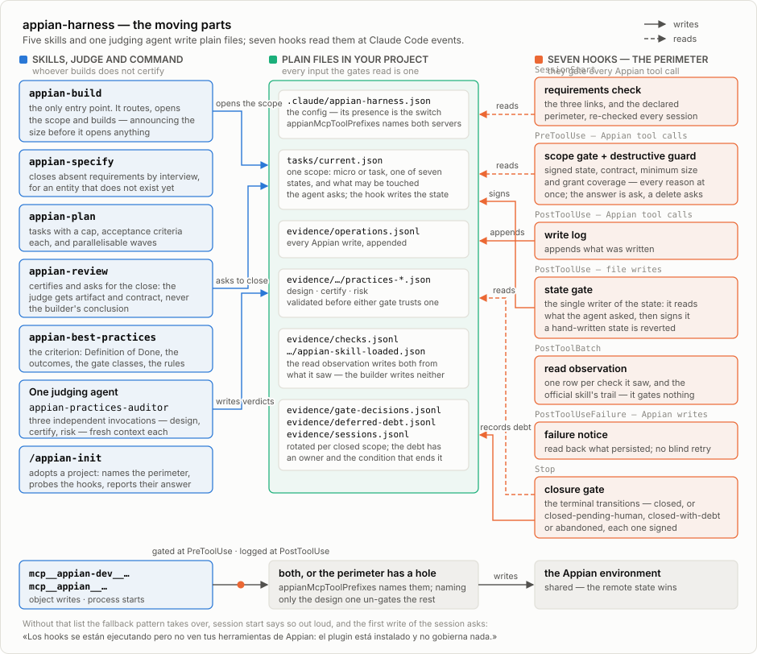

# The gates, the guarantee and the pyramid

> Part of the [appian-harness](../README.md) documentation.

<figure>
  <picture>
    <source media="(prefers-color-scheme: dark)" srcset="assets/architecture-dark.svg">
    
  </picture>
  <figcaption>The moving parts. Skills and the judge write plain files in your
  project; the hooks read them at Claude Code events — nothing coordinates
  except through the files. Solid arrows write, dashed arrows read, and the
  strongest thing the write gate ever says is <em>ask</em>.</figcaption>
</figure>

## The gates

Everything above, the install and configuration sections aside, is doctrine an
agent can decide to skip. The hooks make skipping it **visible and awkward**,
and make the cheapest forgery fail — they cannot make forgery impossible for an
agent that can write files. That distinction is the honest version of what this
section used to claim, and it is worth stating before the list rather than
after it: every input the gates read is a plain file in your project, and the
agent being gated can write all of them. What the hooks remove is the *cheap*
way past — the missing verdict, the
fabricated citation, the audit of one task copied over another's, the
unexplained deferral. What they cannot remove is an agent that sits down and
authors a coherent lie. The last line of defence there is a person reading the
citations, which is why the citations must resolve.

- **requirements check** (at session start) — are the three links of
  [Requirements](../README.md#requirements) present: a design MCP, the official
  Appian skill, a
  documentation MCP? It **informs and never blocks**, because a session missing
  one is still worth having for reading, specifying and planning; what must not
  happen is reaching the first write before finding out. It reads the same
  configuration Claude Code does — `.mcp.json` and `~/.claude.json` — so it
  reports what is **declared**, and says so: configured and answering are
  different states, and it asks for `validateExpression("1 + 1")` rather than
  pretending otherwise. A project that has not adopted the harness hears
  nothing, and a configuration it cannot read is reported as unknown rather
  than as missing — a check that cries wolf is one people learn to scroll past.
- **scope gate** (before any Appian write) — is a scope open, is this object
  inside it, does the scope file still say what it said when permission was
  given, is this an irreversible action, is the scope atomic, and — where the
  scope's shape calls for one — is there a *passing* `design` audit? It
  accumulates every reason it finds rather than reporting the first. Not merely
  present: structurally valid, with citations that resolve, and an outcome of
  `PASS` or a sanctioned deferral.

  **It only sees what the perimeter declares.** `appianMcpToolPrefixes[]` in the
  project's config names the tool-name prefixes of your Appian servers — the
  design one *and* the runtime one. Until 0.7 this was guessed from the server's
  name containing the string `appian`, which meant a server called anything else
  left every gate here silent while the hooks went on answering. Without the key
  the old guess still applies as a fallback, session start says so out loud, and
  the first write of each session asks.

  Two things it used to check are gone from this list and not from the code:
  whether the work sits inside an authorized run, and whether another builder
  holds a lease on the object. Both belong to the previous rulebook, which the
  hooks keep so that work opened under the old rules can still finish. On a scope
  opened today neither has any effect.

  The official skill's load record moved too, and the move is the improvement:
  **the hook writes it from what it observed**, so its absence is now a remedy
  handed to the model rather than a question put to a person.
- **destructive guard** (part of the scope gate) — a delete is not a stricter
  update, it is a different question. It **always** prompts, even with a clean
  impact assessment on file, because destroying something in a shared
  environment is not a decision this harness should make quietly on your
  behalf. What it also checks is that `getObjectDependents` was actually run for
  *that* object and recorded at `<evidenceDir>/<task>/dependents.json` —
  because **"checked, zero dependents" and "never checked" are different
  answers**, and only one is evidence. Reading dependents is never gated, so the
  check the guard demands can always be run.
- **closure gate** (on stop) — while a scope is open, a stop does not pass
  until the **floor for what was touched** is met from what the hooks observed,
  and until the verdicts the lane owes are present, passing, and **no older than
  the scope's most recent write that could have changed what they assert.**
  Which verdicts are owed follows from the work: a `certify` wherever the lane
  bought a reviewer, a `design` where the scope's shape called for one, and an
  adversarial `risk` pass when the work touches security, data or something
  irreversible — which the hook decides by looking at the writes, not by reading
  a level someone declared. A verdict is a claim about a version of the work: review comes
  back FAIL, the fix writes more objects, and re-running only `phase=review`
  used to close the task on two PASSes certifying an artifact that no longer
  existed. The gate compares each verdict against `operations.jsonl` and names
  the stale ones. `design` is exempt — it is *supposed* to predate every write. And a write that
  **could not** have changed what a verdict asserts does not expire it: a
  description-only change leaves the certification standing, including on an
  object published in a site.

  On a repeated stop it approves rather than deadlocking, and records the
  omission as `NOT MEASURED · BLOCKING` debt, because a guardrail that cannot be
  satisfied gets switched off and then protects nothing. With no scope open it
  approves without checking anything.

  **It is also the only thing that writes the outcome, and it signs it.** A state
  that turns up in the scope file without that signature is reverted — so editing
  the file by hand to say the work is finished, or suspended, approves nothing.
- **write log** and **failure notice** — the harness records what was written,
  and tells an agent not to retry a failed write blind.
- **read observer** (after each batch of tool calls) — credits the verification
  reads it sees, tying each to the write it came after and recording what class
  of guarantee it buys. A read taken *before* the write it would vouch for does
  not count, which is what stops a check being reused to cover a change it never
  saw.
- **evidence-write log** (after any `Write` or `Edit`) — records edits aimed at
  the three files the gates themselves read: the evidence tree,
  `.claude/appian-harness.json`, and the scope file. It **logs and does
  not gate**, deliberately. The auditor legitimately writes verdicts and
  `appian-build` legitimately opens the scope file, and a hook cannot
  tell which agent is holding the pen — `PostToolUse` carries the tool and its
  arguments, never the identity of the subagent that called it. Gating would
  therefore question the harness's own correct operation on every task, which
  is the friction that gets a harness switched off; logging costs nothing and
  turns "did somebody write their own passing verdict?" from unanswerable into
  a line in `<evidenceDir>/evidence-writes.jsonl`.

The write gate never answers *deny* — the strongest thing it says is *ask* — and
when the closure gate blocks for missing verdicts it blocks once, approving a
second stop attempt and writing down what went unverified. Both shapes come from
the same reasoning: a guardrail with no way past it gets switched off, and then
it protects nothing. That escape is for missing verdicts only: a running hook
that cannot inspect something — an unreadable config, malformed JSON — asks or
blocks **every** time, with no second-attempt release, because a hook that
cannot see is not a hook that should be waved through. (Verified both ways: an
unparseable config blocks the repeat `Stop` exactly as it blocks the first.)

One case sits outside that rule, and it is worth naming rather than letting a
reader discover it. When **no Python interpreter can be found at all**, the hook
never starts, and `run_hook.sh` answers in its place from shell — where a `Stop`
hook has only *approve* and *block*, no *ask*. It therefore mirrors the
block-once shape rather than the block-always one, because blocking forever with
no way to satisfy the gate is the deadlock that gets guardrails switched off.
What it does not do is go quiet: it approves loudly, saying in the message that
no verdict was checked and that the task must not be treated as verified.

## How the best-practices guarantee actually works

The plugin's distinctive claim is that nothing gets written or certified without
the official doctrine having been applied to it. That claim deserves to be
explained rather than asserted, because part of it cannot be enforced at all.

**What is impossible.** A hook cannot see a subagent's transcript. There is
therefore no way for any gate here to verify that `appian-practices-auditor`
loaded `appian-best-practices` or opened the section it needed. Any plugin
claiming to enforce that is claiming something its hooks cannot check.

**What is verified instead: the trail.** Every verdict must carry a non-empty
`referencesApplied`, each entry shaped `<file>.md#<anchor>`. Before either gate
accepts a verdict, `scripts/validate_verdict.py` resolves every one of those
entries against `skills/appian-best-practices/references/`: the file has to
exist in this plugin, and the anchor has to match a heading actually present in
it. A fabricated citation fails there exactly like a missing file — and it
fails the *gate*, not just a linter, because the gate runs that validation
itself.

**What that proves.** That the cited section exists and any third party can go
and read it. That is the failure mode which actually occurs: not a refusal to
cite, but the plausible citation that turns out not to exist.

**What it does not prove.** That the auditor read the section. That the section
was the right one for the change. That the judgement built on it was sound.
Reading the citations and disagreeing with them is still a person's job; what
the plugin removes is the possibility of citations that cannot be checked.

Two things reinforce the trail without closing that gap. The judging agent
declares `skills: [appian-best-practices]` in its frontmatter, and is
instructed to restate a heading of that skill *before its first tool call*, so a
`Read` cannot stand in for having been given the doctrine. Both are stronger
than nothing and weaker than proof; the honest summary is that the citations are
checked mechanically and everything else is convention.

**Shape is not outcome, and the gates check both.** `validate_verdict.py`
deliberately says nothing about whether a verdict passed — it answers "is this a
well-formed audit of *this* task and *this* phase, whose citations resolve?" and
stops. The gates add the outcome check on top: a phase satisfies a gate only on
`PASS`, or on `NOT_MEASURED` with `notMeasuredClass: DEFERRED`, which the
validator requires to carry an `owner`, a `closingCondition` and a
`deferredCriterion` naming one entry off the plugin's closed deferrable list.
`FAIL` never satisfies — a gate that accepts a `FAIL` is not a gate.
`NOT_MEASURED` / `BLOCKING` never satisfies either: that class means the harness
could have measured this and did not, which is a process failure rather than a
limitation.

**A verdict is a claim about particular work, and it is checked as one.** Both
gates assemble the path they open from a task id and a phase, and both pass
those two strings to the validator, which rejects a document naming different
ones. Without that, `phase` was only ever checked against a list of four legal
values — so a single audit reading `{"task": "TASK-999", "phase": "qa"}` opened
all four gates once it was copied into all four filenames, and four copies of
one audit were indistinguishable from four independent ones. The deferrable
list is checked the same way: it lives in code as `DEFERRABLE_CRITERIA`, a
deferral must name which entry it invokes, and the entry it names has to be on
the list. The reference document lists the same ids and a test fails if the two
copies ever disagree.

## The floor: what each kind of object has to clear

There is no verify phase to invoke. What a change owes is decided by **the kind
of object that was touched**, and the closure gate reads it off what the hooks
observed rather than off what anybody reported.

| Object touched | What the floor buys |
|---|---|
| **Interface** | Design validation, a re-read, and a **pair** of test renders — one against populated data, one against the identifier the project guarantees does not exist |
| **Expression rule** | Design validation, a re-read, and its existing test cases actually run |
| **Process model** | Design validation, a re-read, and its node graph checked for structural faults |
| **Record type** | Design validation, a re-read of the type and its fields, and a data read that returns rows |
| **Record data** | A before-and-after difference, not merely a read |
| **Object security** | A difference against what the security was before |
| **Group** | A re-read, and its membership |
| **Web API · integration · connected system** | Design validation and a re-read |
| **Site · application · constant · folder · document · test case · user filter** | A re-read: the object is there and says what it should |

Two rows cut across all of them:

- **Cross-references.** If the change points at something — a rule, a record
  type, a constant — the thing it points at has to be there. A reference to a
  target that does not exist is caught before the work finishes.
- **Types no tool can write.** Some objects have no write API at all. They are
  planned in their place in the dependency graph anyway, and they close **as
  finished, with their residue recorded** — not left waiting on a person. The
  distinction matters: a residue is a note about what the tooling could not do;
  it is not a way to postpone a gate, and a verdict that uses one as a deferral
  is rejected.

**The empty render is not optional and does not substitute.** A loop over an
empty list never evaluates its body, so a broken screen passes every test case
it has until a row exists (field experience). That is why the pair is a pair.

**A check nothing could have invalidated is not repeated.** A write to an object
outside this scope does not expire this scope's checks, and neither does a change
that could not alter behaviour — a description, for instance — even on an object
published in a site. The alternative, re-running everything after every write, is
how a harness comes to cost more than the work.

**A failing instrument never changes the size of the scope.** If a test render
answers with a 500, the first move is to establish that the failure is not a
regression caused by the change itself — the same failure on a neighbouring
object of the same family will do, and so will a clean measurement from before
the write. Only then is it treated as the tooling's fault, and then the harness
looks for evidence by another route rather than stopping. If there is none, the
scope finishes **waiting on a person, while still being the size it was**. A
defect in the environment is not a change of scope.

## The judge, and which findings can stop you

One agent judges, invoked up to three times with a fresh context each time. Fresh
context each time is the point — a second judgement that inherits the first one's
framing is not a second judgement.

| Invocation | When it is owed |
|---|---|
| `design`, before the first write | Only on a `task`, and only one that **creates** objects or touches **structure, security or a process model**. A `micro` never owes one, and a `task` that merely modifies chooses — with the choice, and its omission, registered |
| `certify` | Wherever the lane bought a reviewer |
| `risk` | When the work touches security, data or something irreversible |

**The verdict is a matrix of object against gate**, and each cell is one of three
kinds, which is what keeps a judge from being asked for an opinion it has no
basis for:

| Kind of cell | Who actually decides it |
|---|---|
| **Imported** | Nobody judges it. It is a check the hooks already observed, and the cell names the row it came from — never the row's contents |
| **Judged on evidence** | The judge decides, and must cite the evidence row it decided from |
| **Full judgement** | The judge decides from the artifact |

That is also why no judge is ever handed a dump: an imported cell carries a
reference, so a whole verdict stays small enough to read.

**Not every finding blocks.** The seven gates are graded, and only one grade
stops a close:

| Class | Gates | Effect on closing |
|---|---|---|
| **Cardinal** | Platform correctness, functional behaviour, security, SAIL interfaces | **Blocks.** A `FAIL` here is not negotiable |
| **Recommended** | — | Reported, argued about if you like, does not block |
| **Contextual** | Maintainability, performance | Reported. **Does not block** |

Maintainability and performance are worth knowing and are not worth a remediation
loop nobody finishes. A bounded loop that always terminates catches more real
defects than an unbounded one that people learn to bypass.

**Re-issuing a verdict is capped, and the cap is enforced.** At most one
re-issue that brings no new finding, at most three in total, and the validator
rejects a third that brings nothing new — it compares the finding sets on disk
rather than taking the judge's word for it. A cap only the agent enforces is
advice.

## The verification pyramid

Each level is named by what it catches, and each is honest about what it cannot
see. Cheapest first.

| Level | Operates on | Catches |
|---|---|---|
| **N0** Syntax | the expression | Whether it parses and whether the rules it calls exist |
| **N1** Static | the source | Components, icons, enumerated values, patterns, accessibility rules |
| **N2** Structural | the **evaluated component tree** | Everything that only exists once data is resolved |
| **N3** Coordinates | process models | Overlapping nodes, proximity, backward flow, disconnected nodes |
| **N4** Behaviour | test cases and the regression suite | Nominal, empty, null, error and repeat paths |
| **N5** Perceptual | a screenshot of the running site | Visual hierarchy, density, responsiveness, focus |
| **N6** Human | — | Screen reader, Design Guidance, real login per role |

**N2 is the level most harnesses are missing.** A rendered-interface test does
not return an image, but it returns the component tree **already evaluated with
resolved data** (field experience) — heading tags, labels, row headers,
empty-grid messages, and colours that came out of the database. Those colours
do not appear in the source at all, so no linter over the source will ever see
them. That is the gap a 1.6:1 status chip walks through.

Two operating notes for N2, both learned the hard way and offered as field
experience rather than documentation: the default response size cap truncates a
real screen, so raise it and trust the truncation flag rather than the byte
count; and some API surfaces fail to serialize certain component types, so pick
the surface that answers correctly rather than the one that answers first.

**Where each level actually lives, since the table does not say.** N0 and N1 are
the platform's own checks and the doctrine in `appian-best-practices`; N4 is the
project's test cases and regression command; N5 and N6 are people. N2 and N3 are
the only levels this repository implements as code — `scripts/n2_interface_tree.py`
(`check_tree(tree, empty_path=False)`, over an evaluated component tree) and
`scripts/n3_process_layout.py` (`check_layout(nodes, edges)`, over node
coordinates). Both are importable modules with unit tests **and a command-line
entry point**:

```
python3 scripts/n2_interface_tree.py TREE_JSON [--empty-path]
python3 scripts/n3_process_layout.py LAYOUT_JSON
```

Each prints one line per finding and exits **0** clean, **1** findings, **2**
usage, **3** `NOT MEASURED`, so a clean run is distinguishable from a run that
never happened. That last code is what makes the sentence true, and it had to be
earned: both checkers used to answer `OK` and exit 0 when they did not
understand their input, so an unrecognised screen looked exactly like a checked
one. **N2** answers 3 when a tree holds no component of a type it judges — run
it with no arguments to see that vocabulary, which is built from the constant
the checks apply rather than restated beside it — and it names the types it saw
but does not judge even on a run that did measure something, so a partial gap is
visible instead of assumed empty. **N3** answers 3 when a layout names no nodes.
`lint_skills.py` uses the same code for its own zero-skills case, which is where
this plugin first argued that nothing checked is not a pass.
**No hook runs them for you.** They are checkers somebody invokes, not checks
the harness performs on your behalf, and describing them any other way would be
the overclaim this plugin exists to argue against.

