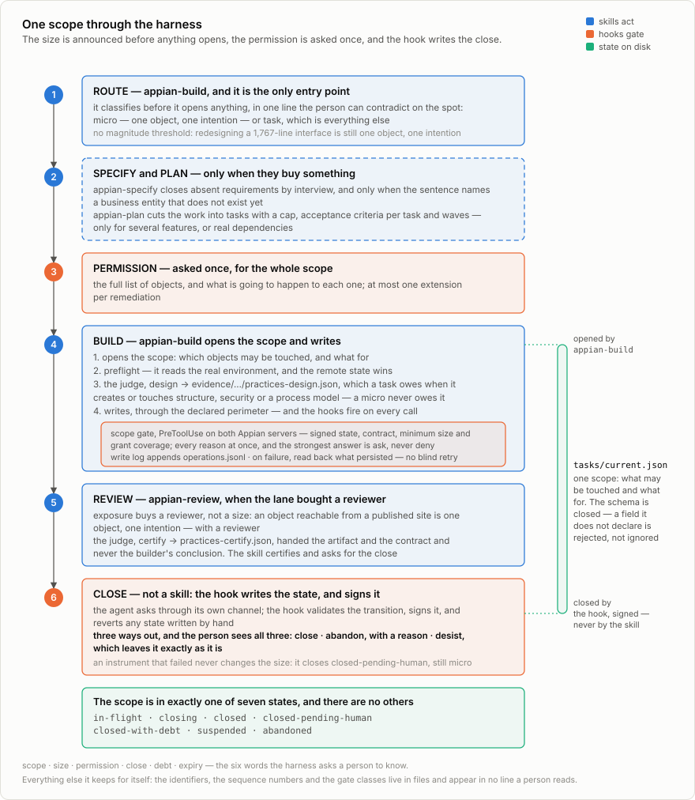

# Using the harness, end to end

> Part of the [appian-harness](../README.md) documentation.

This document is the longest of the three ways in — the whole cycle, for a whole
application. The other two are shorter on purpose and are described where
somebody first looks, in [Which path is
yours](../README.md#which-path-is-yours): advice with nothing adopted, which
needs no configuration and no MCP server, and one small change, which skips
SPECIFY and PLAN and may resolve REVIEW as exempt. They are not lesser versions
of what follows; they are the right answer to a smaller question, and reaching
for this page when one of them fits is how a harness earns a reputation for
getting in the way.

## How it is used, end to end

<figure>
  <picture>
    <source media="(prefers-color-scheme: dark)" srcset="assets/task-lifecycle-dark.svg">
    
  </picture>
  <figcaption>One task, end to end. <code>tasks/current.json</code> is created by
  <code>appian-build</code> and deleted by <code>appian-review</code>; the window
  in between is the closure gate's whole reach, and the builder's own blocked
  stop is the handoff into verification, not a failure.</figcaption>
</figure>

One small task, all the way through. Say the request is *"users need to see the
requests that are still open"*, and the plan has already turned that into
`TASK-3: list open requests`. Paths below use the defaults; which of them are
configurable, and how, is [What the plugin asks of your
project](configuration.md).

**1. `appian-specify`** — asks one question at a time and writes a
specification: actors, entities and relationships, states and transitions, an
authorization matrix, expected volume, and an explicit *out of scope*. Nothing
automated checks this and nothing should; it is read by a person, and no Appian
object exists yet for a gate to have an opinion about.

**2. `appian-plan`** — reads that specification and writes **two** files: the
plan, and the operational state. Two rather than one because a plan is approved
and then stable while state changes every task, and a file that is both is
trusted as neither. It cuts the work into vertical slices — record type → query
rule → interface → test case — ordered by the dependencies Appian actually
imposes, and gives each task four named parts: `allowedObjects`,
`acceptanceCriteria`, `requiredGates`, `evidenceFile`. Two more are optional and
both are decided here rather than at build time, by someone who is not about to
be inconvenienced by them: `risk`, which sets how many verdicts close the task,
and `requiresHumanConfirmation`, which stops an unattended run and hands the
task to a person. Still nothing automated, but this is where the later prompts
are decided: `TASK-3` listing seven objects is a task that will stop at every
write.

**3. `appian-build TASK-3`** — invoked by name, or reached by `appian-run`
inside an authorized run. It is the one skill with irreversible side effects,
and what guards that is no longer a frontmatter flag but the run authorization
the scope gate checks. In order, it:

- writes the active task file, `tasks/current.json`, as
  `{"id": "TASK-3", "allowedObjects": ["APP_openRequests", "..."]}` — spelled
  with those two keys, because the hooks look for those names and nothing near
  them;
- **preflights**: reads the real environment and classifies every object in
  scope as ABSENT, PRESENT AND CONFORMING, PRESENT BUT INCOMPLETE, or
  CONFLICTING. The remote state wins over any local document. All reads, so no
  gate fires;
- dispatches `appian-practices-auditor` with `phase=design` — *before the first
  write, while changing the answer is still free* — which writes
  `evidence/TASK-3/practices-design.json`;
- **then writes.** This is where the **scope gate** fires, on `PreToolUse`: is
  there an active task, is this object in its `allowedObjects`, is the task
  within the atomicity budget, and is that design verdict present, structurally
  valid and passing? It accumulates every failure rather than reporting the
  first, and the strongest thing it says is *ask*;
- every write is appended to `evidence/operations.jsonl` by the **write log** on
  `PostToolUse`, and a write that errors triggers the **failure notice**: do not
  retry blind, read back whether it persisted;
- records the identifiers the environment actually returned into the task's
  `evidenceFile`;
- **stops, and leaves the active task file exactly where it is.** One task, one
  stop — but stopping is a handoff into verification, not the end of the task,
  so the task stays in flight and `appian-review` clears the file at close. The
  ordinary consequence is that this stop is *blocked* by the closure gate,
  naming the three verdicts that do not exist yet. That is the harness stating
  the handoff rather than leaving it to memory.

**4. `appian-verify`** — a fresh invocation, because the builder is the worst
judge of its own work. It dispatches the auditor with `phase=implementation`
(→ `evidence/TASK-3/practices-implementation.json`), renders the screen
**twice** — once against a populated dataset, once against the identifier the
project guarantees does not exist — and only then dispatches `phase=qa`
(→ `practices-qa.json`). Both renders are required and neither substitutes for
the other: a loop over an empty list never evaluates its body, so a broken
screen passes every test case it has until a row exists (field experience).
Then `appian-verifier` emits a result for every gate in `requiredGates`, naming
the evidence behind each `PASS`, and the whole thing is consolidated into
`evidence/TASK-3/gates.md` so the next reader opens one account instead of
reassembling three.

**5. `appian-review`** — graduated by risk, so it does not run in full on
everything. What enters review gets two agents, both with `phase=review`:
`appian-reviewer` against the task contract, `appian-practices-auditor` against
domain doctrine. Neither reads the other's output before forming its own, and
neither is handed anything the builder wrote about why the change should pass.
The auditor's verdict goes to `evidence/TASK-3/practices-review.json`; the
findings go to `evidenceFile`. A review recorded only in `evidenceFile` closes
nothing, because that is not the file the gate opens. Then — **last, after the
verdict exists** — it deletes the active task file. That deletion is the
recorded act of closing the task, which is why it belongs to the phase that
runs last and not to the builder that stopped first.

**6. CLOSE** — no skill; the **closure gate** on `Stop`. While the active task
file names a task in flight, a stop cannot pass without valid, passing
`practices-implementation`, `practices-review` and `practices-qa`. It names
exactly which are missing, invalid or failing. On a repeated stop it approves
instead of deadlocking, and writes the omission to
`evidence/deferred-debt.jsonl` as `NOT_MEASURED` / `BLOCKING` — recorded, not
waived.

The sequencing is what makes that gate reach anything, so it is worth stating
outright: **a task is in flight from the moment `appian-build` takes it until
`appian-review` deletes the file, and the closure gate approves any stop with
nothing in flight.** Every stop in between — the builder's own, and any stop
during verification or review — meets the three-verdict check. Until
2026-08-09 `appian-build` deleted that file when it stopped, which left nothing
in flight and made this gate approve, unchecked, in exactly the flow everyone
uses; the check only ever bit on a session that happened to stop with a task
still open.

The visible cost of the fix is that a clean build now ends in a blocked stop.
That block is correct — the task really is unverified at that moment — and its
wording names the next phase rather than only what is missing. The wrong way
past it is deleting the active task file, which does not satisfy the gate but
retires it.

## Running a plan without a keystroke per task

`appian-build` builds one task and stops — that has not changed, and it is the
unit a reviewer can reject on its own. What changed is that **starting** each one
no longer needs a person. It used to carry `disable-model-invocation: true`, so
a twenty-task plan cost twenty interventions that decided nothing, while the
decisions actually worth attention were spread thin among them.

`/appian-run` grants a run instead: **once, bounded, and written where the gate
reads it.** It sequences build → verify → review per task, retries a FAIL up to
a fix budget, and stops on eight closed conditions — the first of which is
anything irreversible, which **no authorization ever covers.**

**Be clear about what removing that flag widens.** The model can now start a
build on its own. Four things still stand between it and a write — an active
task file, the object in `allowedObjects`, the official-skill load record, and
a passing `design` verdict — and it has to produce all four, which is not
something that happens by accident. But if you want the narrower guarantee back,
configure `activeRunFile`: with it set, a write outside an authorized run asks,
and "nobody granted this" becomes a thing the gate can say rather than a thing
you hope. Left unset, no write-time behaviour changes at all — but the
invocation guarantee does not come back on its own, which is the trade this
section is about.

```json
{ "activeRunFile": "tasks/run.json" }
```

The run file has to name a budget — `maxTasks` and `tasksCompleted`, both whole
numbers — and the gate refuses a grant without one. That is not bookkeeping:
`maxTasks` is the difference between *the user authorized this run* and *the
user authorized everything from here on*, and a file missing it, or spelling it
`"5"`, used to read as the wider of the two while looking like the narrower.
Delete the file when the run ends; an authorization that outlives its plan
authorizes the next one.

## Building several tasks at once

More than one builder can work at a time. Doing it safely needs **two separate
isolations**, and the one people reach for covers the wrong half:

> **A git worktree isolates files. It does not isolate Appian.** Two builders in
> two worktrees calling `createRecordType` write to the same environment.

| Isolation | Protects | Mechanism |
|---|---|---|
| **Local** | Source files, the active task file, the evidence tree | One git worktree per builder |
| **Remote** | The Appian objects, where a collision is not a merge conflict but a change that silently loses | `leaseFile`, checked by the scope gate |

Turning it on is two decisions. First, prove the tasks are independent —
`scripts/parallel_safety.py` reads the plan's `allowedObjects` and `dependsOn`
and refuses on shared objects, on dependencies **including transitive ones**,
on anything destructive, and on objects everything quietly depends on:

```
# partition the whole plan
python3 "${CLAUDE_PLUGIN_ROOT}/scripts/parallel_safety.py" PLAN_JSON

# check one proposed group
python3 "${CLAUDE_PLUGIN_ROOT}/scripts/parallel_safety.py" PLAN_JSON --group T-3,T-5
```

Exit `0` clean, `1` findings, `2` usage, `3` NOT MEASURED — and 3 is not a
pass. The transitive case is the one worth knowing: T-1 ← T-2 ← T-3 has no
direct edge between T-1 and T-3, and they are still not independent.

Second, point `leaseFile` at a register **shared by every worktree**. Each
builder claims its `allowedObjects` before its first write and releases them at
close. The gate's rule is one-sided on purpose: **a lease held by another task
blocks; no lease at all does not** — requiring one would break every
single-builder project, which is the default.

Reviewers and researchers stay read-only regardless. Concurrency here is for
multiplying perspectives and independent slices, never for multiplying writers
on one object.

